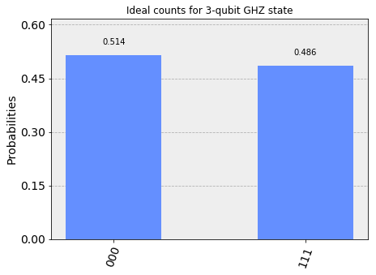
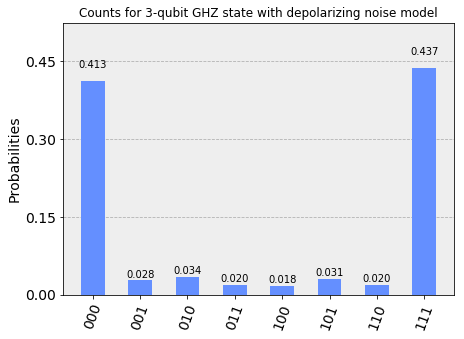
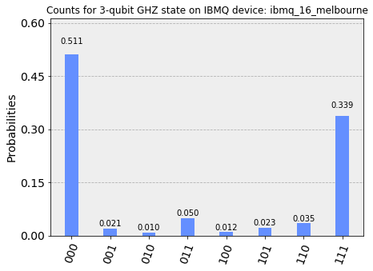

Use a Simple Device Noise Model
===============================

Introduction
------------

This tutorial shows how to use the Qiskit Aer™ ``noise.device`` module
to automatically generate a noise model for an IBM Q™ hardware device,
and use this model to do noisy simulation of ``QuantumCircuits`` to
study the effects of errors which occur on real devices.

Note that these automatic models are only a highly simplified
approximation of the real errors that occur on actual devices. The study
of quantum errors on real devices is an active area of research and we
discuss the Qiskit Aer tools for configuring more detailed noise models
in another notebook.

Device noise module
-------------------

The Qiskit Aer device noise module contains two functions to
automatically generate a simplified noise model for a real device. This
model is generated using the calibration information reported in the
``BackendProperties`` of a device.

.. code:: python

    from qiskit import Aer, IBMQ, execute
    from qiskit.providers.aer import noise
    from qiskit import QuantumCircuit, QuantumRegister, ClassicalRegister
    from qiskit.tools.visualization import plot_histogram
    from qiskit.tools.monitor import job_monitor

IBM Q Provider
~~~~~~~~~~~~~~

We will use a real hardware device in the ``IBMQ`` provider as an
example. First we must load our account credentials, and then select a
backend from the provider.

.. code:: python

    provider = IBMQ.load_account()
    provider.backends()

.. code-block:: text

    [<IBMQBackend('ibmqx4') from IBMQ()>,
     <IBMQBackend('ibmq_16_melbourne') from IBMQ()>,
     <IBMQBackend('ibmq_qasm_simulator') from IBMQ()>]

We will use the ``ibmq_14_melbourne`` device for this tutorial. We may
get the properties of the backend using the ``properties`` method, the
information in the returned ``BackendProperties`` object will be used to
automatically generate a noise model for the device that can be used by
the Qiskit Aer ``QasmSimulator``. We will also want to get the
``coupling_map`` for the device from its ``configuration`` to use when
compiling circuits for simulation to most closely mimic the gates that
will be executed on a real device

.. code:: python

    device = provider.get_backend('ibmq_16_melbourne')
    properties = device.properties()
    coupling_map = device.configuration().coupling_map

Test circuit for device and simulation comparison
~~~~~~~~~~~~~~~~~~~~~~~~~~~~~~~~~~~~~~~~~~~~~~~~~

Now we construct a test circuit to compare the output of the real device
with the noisy output simulated on the Qiskit Aer ``QasmSimulator``. We
will prepare a 3-qubit GHZ state
:math:`\frac{1}{2}(|0,0,0\rangle + |1,1,1\rangle)` on qubits 0, 1 and 2.
Before running with noise or on the device we show the ideal expected
output with no noise.

.. code:: python

    # Construct quantum circuit
    qr = QuantumRegister(3, 'qr')
    cr = ClassicalRegister(3, 'cr')
    circ = QuantumCircuit(qr, cr)
    circ.h(qr[0])
    circ.cx(qr[0], qr[1])
    circ.cx(qr[1], qr[2])
    circ.measure(qr, cr)

    # Select the QasmSimulator from the Aer provider
    simulator = Aer.get_backend('qasm_simulator')

    # Execute and get counts
    result = execute(circ, simulator).result()
    counts = result.get_counts(circ)
    plot_histogram(counts, title='Ideal counts for 3-qubit GHZ state')

Generating a device noise model
-------------------------------

Noise models in Qiskit Aer are presented using the ``NoiseModel`` object
from the ``aer.noise`` module. The function we will use is the
``basic_device_noise_model`` function from ``aer.noise.device`` module
which will return a basic approximate ``NoiseModel`` object configured
from a device ``BackendProperties``.

Basic device noise model
~~~~~~~~~~~~~~~~~~~~~~~~

The ``basic_device_noise_model`` constructs an approximate noise model
consisting of:

-  **Single-qubit gate errors** consisting of a single qubit
   depolarizing error followed by a single qubit thermal relaxation
   error.
-  **Two-qubit gate errors** consisting of a two-qubit depolarizing
   error followed by single-qubit thermal relaxation errors on both
   qubits in the gate.
-  **Single-qubit readout errors** on the classical bit value obtained
   from measurements on individual qubits

For the gate errors the error parameter of the thermal relaxation errors
is derived using the ``thermal_relaxation_error`` function from
``aer.noise.errors`` module, along with the individual qubit :math:`T_1`
and :math:`T_2` parameters, and the ``gate_time`` parameter from the
device backend properties. The probability of the depolarizing error is
then set so that the combined average gate infidelity from the
depolarizing error followed by the thermal relaxaxtion is equal to the
``gate_error`` value from the backend properties.

For the readout errors the probability that the recorded classical bit
value will be flipped from the true outcome after a measurement is given
by the qubit ``readout_errors``.

Let us construct the device noise model.

**Note:** *Since the devices don't currently provide the gate times for
gates we will manually provide them for the gates we are interested in
using the optional ``gate_times`` argument for
``basic_device_noise_model``.*

.. code:: python

    # List of gate times for ibmq_14_melbourne device
    # Note that the None parameter for u1, u2, u3 is because gate
    # times are the same for all qubits
    gate_times = [
        ('u1', None, 0), ('u2', None, 100), ('u3', None, 200),
        ('cx', [1, 0], 678), ('cx', [1, 2], 547), ('cx', [2, 3], 721),
        ('cx', [4, 3], 733), ('cx', [4, 10], 721), ('cx', [5, 4], 800),
        ('cx', [5, 6], 800), ('cx', [5, 9], 895), ('cx', [6, 8], 895),
        ('cx', [7, 8], 640), ('cx', [9, 8], 895), ('cx', [9, 10], 800),
        ('cx', [11, 10], 721), ('cx', [11, 3], 634), ('cx', [12, 2], 773),
        ('cx', [13, 1], 2286), ('cx', [13, 12], 1504), ('cx', [], 800)
    ]

    # Construct the noise model from backend properties
    # and custom gate times
    noise_model = noise.device.basic_device_noise_model(properties, gate_times=gate_times)
    print(noise_model)

.. code-block:: text

    NoiseModel:
      Instructions with noise: ['cx', 'u2', 'u3', 'measure']
      Specific qubit errors: [('u2', [0]), ('u2', [1]), ('u2', [2]), ('u2', [3]), ('u2', [4]), ('u2', [5]), ('u2', [6]), ('u2', [7]), ('u2', [8]), ('u2', [9]), ('u2', [10]), ('u2', [11]), ('u2', [12]), ('u2', [13]), ('u3', [0]), ('u3', [1]), ('u3', [2]), ('u3', [3]), ('u3', [4]), ('u3', [5]), ('u3', [6]), ('u3', [7]), ('u3', [8]), ('u3', [9]), ('u3', [10]), ('u3', [11]), ('u3', [12]), ('u3', [13]), ('cx', [1, 0]), ('cx', [1, 2]), ('cx', [2, 3]), ('cx', [4, 3]), ('cx', [4, 10]), ('cx', [5, 4]), ('cx', [5, 6]), ('cx', [5, 9]), ('cx', [6, 8]), ('cx', [7, 8]), ('cx', [9, 8]), ('cx', [9, 10]), ('cx', [11, 3]), ('cx', [11, 10]), ('cx', [11, 12]), ('cx', [12, 2]), ('cx', [13, 1]), ('cx', [13, 12]), ('measure', [0]), ('measure', [1]), ('measure', [2]), ('measure', [3]), ('measure', [4]), ('measure', [5]), ('measure', [6]), ('measure', [7]), ('measure', [8]), ('measure', [9]), ('measure', [10]), ('measure', [11]), ('measure', [12]), ('measure', [13])]

Simulating a quantum circuit with noise
---------------------------------------

To use this noise model we must make use of several keyword arguments in
the ``execute`` function. These are:

-  ``noise_model``: This passes the noise model to the
   ``QasmSimulator.run`` method for noisy simulation.
-  ``basis_gates``: A noise model is defined with respect to specific
   gates, we must pass these basis gates to the Qiskit compiler so that
   it compiles the circuit to the correct gates for the noise model. The
   basis gates of a noise model may be obtained from the
   ``NoiseModel.basis_gates`` property.
-  ``coupling_map``: We also must make sure we provide the
   ``coupling_map`` for the real device so that the compiler will
   produce a Qobj for the simulator that will match the compiled
   experiment that can be executed on the real device.

.. code:: python

    # Get the basis gates for the noise model
    basis_gates = noise_model.basis_gates

    # Select the QasmSimulator from the Aer provider
    simulator = Aer.get_backend('qasm_simulator')

    # Execute noisy simulation and get counts
    result_noise = execute(circ, simulator,
                           noise_model=noise_model,
                           coupling_map=coupling_map,
                           basis_gates=basis_gates).result()
    counts_noise = result_noise.get_counts(circ)
    plot_histogram(counts_noise, title="Counts for 3-qubit GHZ state with depolarizing noise model")

Comparison to the real device
-----------------------------

Now we will execute the circuit on the real device to see the effect of
the actual noise processes on the output counts. Note that this
execution may take some time to return the results.

.. code:: python

    # Submit job to real device and wait for results
    job_device = execute(circ, device)
    job_monitor(job_device)

.. code:: python

    # Get results from completed execution
    result_device = job_device.result()
    counts_device = result_device.get_counts(0)
    plot_histogram(counts_device, title='Counts for 3-qubit GHZ state on IBMQ device: {}'.format(device.name()))

You might notice that the counts returned in the above histogram don't
look exactly like our simulation. This is because the real errors that
happen on a device can be very complicated, and characterizing them to
create acurate models is an active area of quantum computing research.
The *basic device noise model* we used for our simulation is a
simplified error model that only takes into account *local* errors
occuring on the qubits participating in each individual gate, and treats
the erors as a relaxation process combined with an error operation which
acts to randomize the state of the qubit with some probability *p* (the
depolarizing probability). While this model is an approximation, due to
its simplicity it is a useful starting point for studying the effects of
noise on quantum computations.
