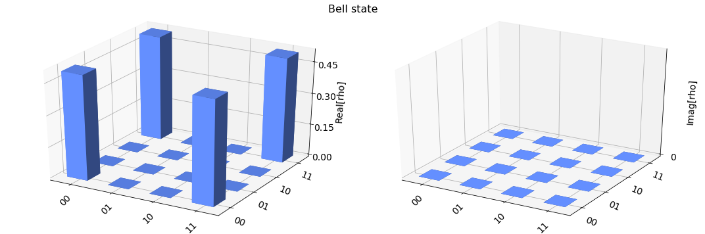
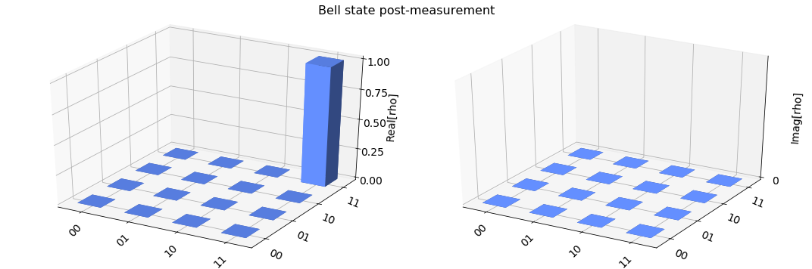

Find the Final Statevector of a Circuit
=======================================

Introduction
------------

This tutorial shows how to use Qiskit Aer™ to find the final statevector
of quantum circuits.

StatevectorSimulator
--------------------

The ``StatevectorSimulator`` executes a single shot of a Qiskit
``QuantumCircuit`` and returns the final quantum statevector of the
simulation. The circuit may contain *gates*, and also *measure*,
*reset*, and *conditional* operations.

Import the ``StatevectorSimulator``.

.. code:: python

    import numpy as np

    from qiskit import QuantumCircuit, QuantumRegister, ClassicalRegister
    from qiskit import Aer, execute
    from qiskit.tools.visualization import plot_state_city

    from qiskit.providers.aer import StatevectorSimulator

Simulating a quantum circuit
~~~~~~~~~~~~~~~~~~~~~~~~~~~~

The basic operation executes a quantum circuit and returns a counts
dictionary of measurement outcomes. Here we execute a simple circuit
that prepares a 2-qubit Bell-state
:math:`|\psi\rangle = \frac{1}{2}(|0,0\rangle + |1,1 \rangle)` and
measures both qubits.

.. code:: python

    # Construct quantum circuit without measure
    qr = QuantumRegister(2, 'qr')
    circ = QuantumCircuit(qr)
    circ.h(qr[0])
    circ.cx(qr[0], qr[1])

    # Select the StatevectorSimulator from the Aer provider
    simulator = Aer.get_backend('statevector_simulator')

    # Execute and get counts
    result = execute(circ, simulator).result()
    statevector = result.get_statevector(circ)
    plot_state_city(statevector, title='Bell state')

Simulating a quantum circuit with measurement
~~~~~~~~~~~~~~~~~~~~~~~~~~~~~~~~~~~~~~~~~~~~~

Note that if a circuit contains *measure* or *reset* the final
statevector will be a conditional statevector *after* simulating
wave-function collapse to the outcome of a measure or reset. For the
Bell-state circuit this means the final statevector will be *either*
:math:`|0,0\rangle` *or* :math:`|1, 1\rangle`.

.. code:: python

    # Construct quantum circuit with measure
    qr = QuantumRegister(2, 'qr')
    cr = ClassicalRegister(2, 'cr')
    circ = QuantumCircuit(qr, cr)
    circ.h(qr[0])
    circ.cx(qr[0], qr[1])
    circ.measure(qr, cr)

    # Select the StatevectorSimulator from the Aer provider
    simulator = Aer.get_backend('statevector_simulator')

    # Execute and get counts
    result = execute(circ, simulator).result()
    statevector = result.get_statevector(circ)
    plot_state_city(statevector, title='Bell state post-measurement')

