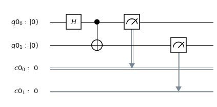

===========================
Getting Started with Qiskit
===========================

This tutorial provides you an overview of working with Qiskit.

The workflow of using Qiskit consists of two high-level steps:

* **Build**: design different quantum circuits that represent the problem you
are solving. * **Execute**: run experiments on different backends (*which
include both systems and simulators*) * **Analysis**: Qiskit provides various
:ref:`visualization tools<Visualizing a Quantum Circuit>` to promote the ease to
analyze the circuit.

Here’s a simple example of the entire workflow:

.. code:: python

    import numpy as np from qiskit import QuantumCircuit, ClassicalRegister,
    QuantumRegister from qiskit import execute, Aer from qiskit.visualization
    import plot_histogram

    # Use Aer's qasm_simulator Q_simulator =
    Aer.get_backend(name='qasm_simulator')

    # Create a Quantum Register with 2 qubits. q = QuantumRegister(2)

    # Create a Classical Register with 2 bits. c = ClassicalRegister(2)

    # Create a Quantum Circuit acting on the q register circ = QuantumCircuit(q,
    c)

    # Add a H gate on qubit 0 circ.h(q[0])

    # Add a CX (CNOT) gate on control qubit 0 and target qubit 1 circ.cx(q[0],
    q[1])

    # Map the quantum measurement to the classical bits circ.measure(q,c)

    # Execute the circuit on the qasm simulator Q_job = execute(circ,
    Q_simulator, shots=1024) # Grab results from the job Q_result =
    Q_job.result()

    # Returns counts counts = Q_result.get_counts(circ) print("\nTotal count for
    00 and 11 are:",counts)

    # Plot the circuit circ.draw(output='mpl')

.. parsed-literal::

    Total count for 00 and 11 are: {'00': 487, '11': 537}

.. code:: python

    # Plot histogram plot_histogram(counts)

Workflow in Detail
-------------------

The program above can be further broken down into six steps:

1. Import packages 2. Initialize variables 3. Add gates 4. Visualize the circuit
5. Simulate the circuit 6. Visualize the results

Step 1 : Import Packages
~~~~~~~~~~~~~~~~~~~~~~~~

The basic elements needed for your program are the ``QuantumCircuit``,
``QuantumRegister``, ``ClassicalRegister`` and ``execute``.

.. code:: python

    import numpy as np from qiskit import QuantumCircuit, ClassicalRegister,
    QuantumRegister from qiskit import execute, Aer from qiskit.visualization
    import plot_histogram

In more detail, the imports are as follows:

* ``QuantumRegister``: holds your qubits. * ``ClassicalRegister``: stores
classical bits (0’s and 1’s). * ``QuantumCircuit``: can be thought as the
instructions of the quantum system. It holds all your quantum operations. *
``execute``: runs your circuit / experiment. * ``Aer``: handles simulator
backends. * ``plot_histogram``: creates histograms.

Step 2 : Initialize Variables
~~~~~~~~~~~~~~~~~~~~~~~~~~~~~~

Consider the next three lines of code

.. code:: python

    q = QuantumRegister(2) c = ClassicalRegister(2) circuit = QuantumCircuit(q,
    c)

Here, you are intializing ``q`` with 3 qubits in the zero state; ``circuit`` is
the quantum ciruit that acts on ``q``.

Syntax:

* ``QuantumRegister(number_of_qubits)`` * ``ClassicalRegister(number_of_bits)``
* ``QuantumCircuit(QuantumRegister, ClassicalRegister)``

.. note::
    ``QuantumCircuit(QuantumRegister)``: When ``ClassicalRegister`` is not used,
    then ClassicalRegister need not be passed as an argument to the
    QuantumCircuit

Step 3 : Add Gates
~~~~~~~~~~~~~~~~~~~

Just like the gates in classical systems which compute a required operation, you
can add quantum gates (“operations”) to manipulate the registers.

Next consider the subsequent three lines of code:

.. code:: python

    circuit.h(q[0]) circuit.cx(q[0], q[1]) circuit.measure(q,c)

The operations are added to the circuit one-by-one to the quantum citcuit.

As you proceed through the documentation, you will find more gates and circuits;
the below is an example of a quantum circuit that makes a two-qubit Bell state

.. math:: |\psi\rangle = \left(|00\rangle+|11\rangle\right)/\sqrt{2}.

To create such a state, you start with a 2-qubit quantum register. By default,
each qubit in the register is initialized to :math:`|0\rangle`.

To make the Bell state, apply the following gates:

* ``QuantumCircuit.h(QuantumRegister)``: A Hadamard gate :math:`H` on qubit 0,
which puts it into a **superposition state**. *
``QuantumCircuit.cx(QuantumRegister)``: A controlled-Not operation
(:math:`C_{X}`) on control qubit 0 and target qubit 1, putting the qubits in a
**Bell state**. * ``QuantumCircuit.measure(QuantumRegister,
ClassicalRegister)``: This function actually calls upon the class ``Measure``,
which handles adding the measurement instruction. Measure takes two arguments,
both the quantum and classical registers. In Qiskit, if we pass the entire
quantum and classical registers as arguments to measure, the function will by
default make a total measurement on the system, and store each qubit’s
measurement results to the corresponding index in the ClassicalRegister

On an ideal quantum computer, the state produced by running this circuit would
be the Bell state above.

Step 4 : Visualize the Circuit
~~~~~~~~~~~~~~~~~~~~~~~~~~~~~~~

Lastly, to view the circuit that you have designed, you can use Qiskit
``QuantumCircuit.draw()``, which plots circuit in the form found in many
textbooks

.. code:: python

    circuit.draw(output='mpl')

.. image:: ./images/figures/getting_started_10_0.png

In this circuit, the qubits are put in order with qubit zero at the top and
qubit two at the bottom. The circuit is read left-to-right (meaning that gates
which are applied earlier in the circuit show up further to the left).

Step 5 : Simulate the Circuit
~~~~~~~~~~~~~~~~~~~~~~~~~~~~~

Qiskit Aer is a high performance simulator framework for quantum circuits. It
provides several :ref:`backends<Executing Quantum Programs>` to acheive
different simulation goals.

To simulate this circuit, you will use the ``qasm_simulator`` of Qiskit Aer.
Each run of this circuit will yield either the bitstring 00 or 11. The
instructions of your ``QuantumCircuit`` are processed through two more classes
before finally coming out in a printable form:

.. math::  execute(QuantumCircuit, backend) \rightarrow job \rightarrow result
\rightarrow display\_the\_results

.. code:: python

    Q_simulator = Aer.get_backend(name='qasm_simulator')

    Q_job = execute(circ, Q_simulator, shots=1000) Q_result = Q_job.result()
    counts = Q_result.get_counts(circ) print("\nTotal count for 00 and 11
    are:",counts)

.. parsed-literal::

    Total count for 00 and 11 are: {'00': 514, '11': 510}

As expected, the output bitstring is 00 approximately 50 percent of the time.
The number of times the circuit is repeated can be specified in the ``execute``
function, via the ``shots`` keyword. The number of shots of the circuit was set
to be 1000 (the default is 1024).

Once you have a ``result`` object, you can access the counts via the function
``get_counts(circuit)``. This gives you the aggregated binary outcomes of the
circuit you submitted.

Step 6 : Visualize the Results
~~~~~~~~~~~~~~~~~~~~~~~~~~~~~~

Qiskit provides a function ``plot_histogram`` to view your results.

.. code:: python

    plot_histogram(counts)

.. image:: ./images/figures/getting_started_14_0.png

The observed probabilities :math:`Pr(00)` and :math:`Pr(11)` are computed by
taking the aggregate counts and dividing by the number of shots.

.. note::
    Try changing the ``shots`` keyword in the ``execute`` function and see how
    the estimated probabilities change.

Conclusion
----------

Now that you have learnt the basics, consider these learning resources:

* `Tutorials
<https://nbviewer.jupyter.org/github/Qiskit/qiskit-tutorials/blob/master/qiskit/start_here.ipynb>`_
* `Video tutorials
<https://www.youtube.com/channel/UClBNq7mCMf5xm8baE_VMl3A/featured>`_ *
`Interactivce tutorials in IBM Q Experience
<https://quantum-computing.ibm.com>`_ * `Frequently Asked Questions
<./faq.html>`_
