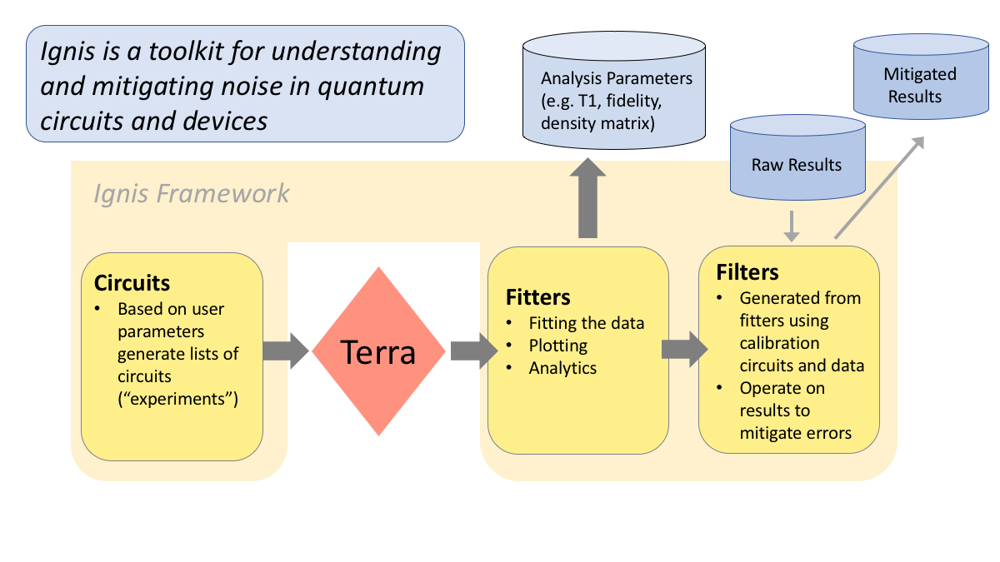

Overview
========

A framework for characterizing and mitigating noise in
quantum circuits and devices.

Ignis provides code for users to easily generate circuits for specific
experiments given a minimal set of user input parameters. Ignis code contains
three fundamental building blocks: circuits, fitters and filters.

Circuits
^^^^^^^^

The circuits module provides the code to generate the list of circuits
for a particular Ignis experiment based on a minimal set of user
parameters. These are then run on Terra or Aer.

Fitters
^^^^^^^

The results of an Ignis experiment are passed to the Fitters module where
they are analyzed and fit according to the physics model describing
the experiment. Fitters can plot the data plus fit and output a list
of parameters.

Filters
^^^^^^^

For certain Ignis experiments, the fitters can output a Filter object.
Filters can be used to mitigate errors in other experiments using the
calibration results of an Ignis experiment.

Ignis Organization
------------------

The Ignis repository is grouped into the types of experiments that can be
performed: characterization, verification and mitigation.

Characterization
^^^^^^^^^^^^^^^^

Characterization experiments are designed to measure parameters in the
system such as noise parameters (T1, T2*, T2), Hamiltonian parameters such
as the ZZ interaction rate and control errors in the gates.

Verification
^^^^^^^^^^^^

Verification experiments are designed to verify gate and small
circuit performance. Verification includes state and process tomography,
quantum volume and randomized benchmarking (RB). These experiments provide
the information to determine performance metrics such as the gate fidelity.

Mitigation
^^^^^^^^^^

Mitigation experiments run calibration circuits that are analyzed to
generate mitigation routines that can be applied to arbitrary sets of results
run on the same backend. Ignis code will generate a list of circuits that
run calibration measurements. The results of these measurements will be
processed by a Fitter and will output a Filter than can be used to apply
mitigation to other results.

*This project uses the* |emphasized hyperlink|_.

.. |emphasized hyperlink| replace:: *Apache License Version 2.0 software license*
.. _emphasized hyperlink: https://www.apache.org/licenses/LICENSE-2.0
