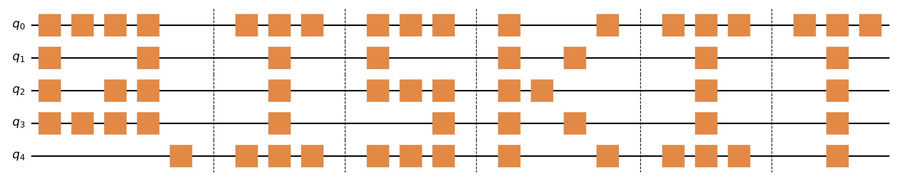

##############################
Qiskit |version| documentation
##############################

Qiskit is open-source software for working with quantum computers
at the level of circuits, pulses, and algorithms.  Additionally, several
domain specific application API's exist on top of this core module.

The central goal of Qiskit is to build a software stack
that makes it easy for anyone to use quantum computers, regardless of their skill level or
area of interest; Qiskit allows one to easily design experiments and applications and run
them on real quantum computers and/or classical simulators.  Qiskit is already in use
around the world by beginners, hobbyists, educators, researchers, and commercial companies.

.. raw:: html

  

     

.. customcalloutitem::
  :description: A quick introduction to quantum computing.
  :header: What is quantum computing?
  :button_link:  qc_intro.html
  :button_text: Get cracking

.. customcalloutitem::
  :description: Find out which Qiskit Partners support execution on real quantum services.
  :header: Access to quantum systems
  :button_link:  https://qiskit.org/documentation/partners/
  :button_text: Qiskit Partners

.. raw:: html

  

Interested in Applications of Quantum Computing?
################################################

.. raw:: html

  

     

.. customcalloutitem::
  :description: Application of Quantum Computing for Optimization Problems
  :header: Qiskit Optimization
  :button_link: https://qiskit.org/documentation/optimization/
  :button_text: Qiskit Optimization

.. customcalloutitem::
  :description: Application of Quantum Computing for Finance
  :header: Qiskit Finance
  :button_link: https://qiskit.org/documentation/finance/
  :button_text: Qiskit Finance

.. customcalloutitem::
  :description: Application of Quantum Computing for Machine Learning
  :header: Qiskit Machine Learning
  :button_link: https://qiskit.org/documentation/machine-learning/
  :button_text: Qiskit Machine Learning

.. customcalloutitem::
  :description: Application of Quantum Computing for Natural Sciences
  :header: Qiskit Nature
  :button_link: https://qiskit.org/documentation/nature/
  :button_text: Qiskit Nature

.. raw:: html

  

Interested in running characterization, calibration, and verification experiments?
##################################################################################

.. customcalloutitem::
  :description: Run characterization, calibration, and verification experiments
  :header: Qiskit Experiments
  :button_link: https://qiskit.org/documentation/experiments/
  :button_text: Qiskit Experiments

Interested in quantum hardware design?
######################################

   .. panels::

    Qiskit Metal
    ^^^^^^^^^^^^^^

    .. image:: images/metal.png
      :scale: 35 %
      :align: center
      :target: https://qiskit.org/documentation/metal/

    ++++++
    :link-badge:`https://qiskit.org/metal,"Website",cls=badge-dark text-white`
    :link-badge:`https://qiskit.org/documentation/metal/,"Documentation",cls=badge-primary text-white`

.. toctree::
  :maxdepth: 1
  :hidden:

  Documentation Homepage <self>

.. toctree::
  :caption: Frontmatter
  :maxdepth: 2
  :hidden:

  qc_intro
  intro_tutorial1
  release_notes
  contributing_to_qiskit
  configuration
  faq

.. toctree::
  :maxdepth: 1
  :caption: Libraries
  :hidden:

  Circuit Library <apidoc/circuit_library>

.. toctree::
  :maxdepth: 1
  :caption: API References
  :hidden:

  Qiskit Terra <apidoc/terra>
  Qiskit Aer <apidoc/aer>
  Qiskit Ignis (deprecated) <apidoc/ignis>
  Qiskit Aqua (deprecated) <apidoc/aqua>
  Qiskit IBM Quantum Provider <apidoc/ibmq-provider>

.. toctree::
  :maxdepth: 1
  :caption: Qiskit Aqua Migration Guide
  :hidden:

  Qiskit Aqua Migration Guide <aqua_migration>

.. toctree::
  :maxdepth: 1
  :caption: Troubleshooting
  :hidden:

  IBM Quantum API error codes <https://quantum-computing.ibm.com/lab/docs/iql/manage/errors>

.. Hiding - Indices and tables
   :ref:`genindex`
   :ref:`modindex`
   :ref:`search`
