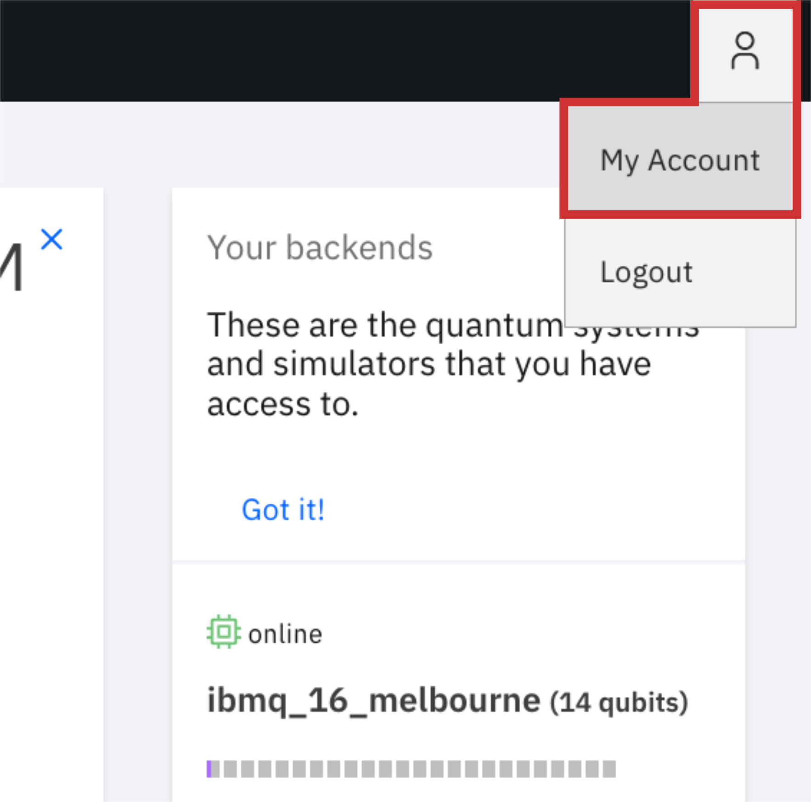
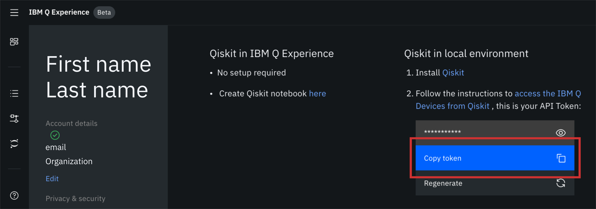

Installing Qiskit
=================

Requirements
------------

Qiskit supports Python 3.5 or later.

We recommend installing `Anaconda <https://www.anaconda.com/download/>`_, a
cross-platform Python distribution for scientific computing. Jupyter Notebook,
included in Anaconda, is recommended for interacting with the `Qiskit tutorials
<https://github.com/Qiskit/qiskit-tutorial>`_.

Qiskit is tested and supported on the following 64-bit systems:

*	Ubuntu 16.04 or later
*	macOS 10.12.6 or later
*	Windows 7 or later

Using Qiskit on Windows requires VC++ runtime components. We recommend one of
the following:

* `Microsoft Visual C++ Redistributable for Visual Studio 2017 <https://
  go.microsoft.com/fwlink/?LinkId=746572>`_
* `Microsoft Visual C++ Redistributable for Visual Studio 2015 <https://
  www.microsoft.com/en-US/download/details.aspx?id=48145>`_

.. note::
  If you want to contribute to the Qiskit community by developing and contributing code
  with the most recently updated Qiskit code, see :ref:`Build Qiskit packages from source <install_install_from_source_label>`.

Install
-------

We recommend using Python virtual environments to cleanly separate Qiskit from
other applications and improve your experience.

The simplest way to use environments is by using the ``conda`` command,
included with Anaconda. A Conda environment allows you to specify a specific
version of Python and set of libraries. Open a terminal window in the directory
where you want to work.

Create a minimal environment with only Python installed in it.

.. code:: sh

  conda create -n name_of_my_env python=3

.. code:: sh

  source activate name_of_my_env

Or, if you're using Windows, use the following command.

.. code:: sh

  activate name_of_my_env

Next, install the Qiskit package, which includes Terra, Aer, Ignis, and Aqua.

.. code:: sh

  pip install qiskit

If the packages installed correctly, you can run ``conda list`` to see the active
packages in your virtual environment.

.. note::

  During installation, you might see the warning message
  ``Failed to build qiskit``. This is a non-fatal error that does not affect
  installation.

There are optional dependencies that are required to use all the visualization
functions available in Qiskit. You can install these optional
dependencies by with the following command

.. code:: sh

  pip install qiskit-terra[visualization]

After you've installed and verified the Qiskit packages you want to use, import
them into your environment with Python to begin working.

.. code:: python

  import qiskit

.. _install_access_ibm_q_devices_label:

Access IBM Q Devices
--------------------

IBM Q offers several real quantum computers and high-performance classical
computing simulators through its `quantum cloud services <https://
www.research.ibm.com/ibm-q/technology/devices/>`_ with Qiskit.

`Create a free IBM Q account <https://quantumexperience.ng.bluemix.net/qx/
login>`_ to get an API token.

After logging in, navigate to **My Account**.

Navigate to the **Advanced** tab and click the **Generate** button in the API Token
section.

Store your API token locally for later use in a configuration file called
``qiskitrc`` by running the following Python code:

.. code:: python

  from qiskit import IBMQ
  IBMQ.save_account('MY_API_TOKEN')

where ``MY_API_TOKEN`` should be replaced with your token.

.. note::

  If you are an IBM Q Network member, you must specify more than just an API token
  by using the following commands.

If you are a member of the IBM Q Network, you must pass an additional argument
to ``IBMQ.save_account()``. The ``url`` argument can be found on your q-console
account page, along with any other additional information required, e.g. proxy
information. Pass your API token and the ``url`` argument by running the
following Python code:

.. code:: python

  from qiskit import IBMQ
  IBMQ.save_account('MY_API_TOKEN', url='https://...')

Refer to :ref:`advanced_use_of_ibm_q_devices_label` for more details, such as
how to manage multiple IBM Q account credentials.

Checking Which Version is Installed
-----------------------------------

Since the Qiskit project is actually a constellation of different elements
simply printing the version string can be misleading. When you run::

   import qiskit
   qiskit.__version__

This only gives you the version for the qiskit-terra package. This is because
the ``qiskit`` namespace in python doesn't come from the qiskit package, but
instead is part of the qiskit-terra package.

Instead if you would like to see the version of all the qiskit elements
installed in your environment you can use the ``__qiskit_version`` attribute.
This will return a dictionary of the different qiskit packages and the
installed versions. For example, running::

   import qiskit
   qiskit.__qiskit_version__

will return a dictionary like::

   {
      'qiskit-terra': '0.7.1',
      'qiskit': '0.8.0',
      'qiskit-ignis': '0.1.0',
      'qiskit-aer': '0.1.0',
      'qiskit-ibmq-provider': '0.1rc2',
      'qiskit-aqua': None
   }

If you're filing an issue or need to share your installed qiskit versions for
something you should use the ``__qiskit_version__`` attribute.
