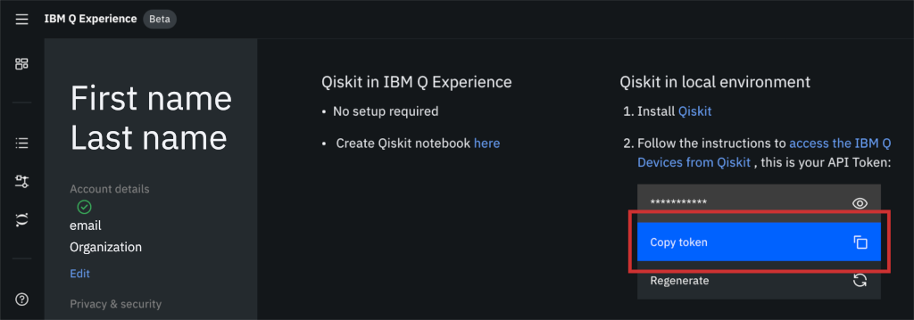

Installing Qiskit
=================

Requirements
------------

Qiskit is tested and supported on the following 64-bit systems:

*	Ubuntu 16.04 or later
*	macOS 10.12.6 or later
*	Windows 7 or later

Qiskit supports Python 3.5 or later.

We recommend installing `Anaconda <https://www.anaconda.com/download/>`_, a cross-platform Python distribution for scientific computing. Jupyter Notebook, included in Anaconda, is recommended for interacting with the `Qiskit tutorials <https://github.com/Qiskit/qiskit-tutorial>`_.

Using Qiskit on Windows requires VC++ runtime components. We recommend one of the following:

*	`Microsoft Visual C++ Redistributable for Visual Studio 2017 <https://go.microsoft.com/fwlink/?LinkId=746572>`_
*	`Microsoft Visual C++ Redistributable for Visual Studio 2015 <https://www.microsoft.com/en-US/download/details.aspx?id=48145>`_

Install
-------

We recommend using Python virtual environments to cleanly separate Qiskit from other applications and improve your experience.

The simplest way to use environments is by using the ``conda`` command, included with Anaconda. A Conda environment allows you to specify a specific version of Python and set of libraries. Run the following commands from a terminal window:

.. code:: sh

  conda create -n name_of_my_env python=3

This will create a minimal environment with only Python installed in it. To put yourself inside this environment run:

.. code:: sh

  source activate name_of_my_env

On Windows the command is:

.. code:: sh

  activate name_of_my_env

The final step required is to install Qiskit with the following command:

.. code:: sh

  pip install qiskit qiskit-aqua

There are optional dependencies that are required to use all the visualization functions available in Qiskit. You can install Qiskit along with these optional dependencies by running

.. code:: sh

  pip install qiskit[visualization] qiskit-aqua

.. _install_install_from_source_label:

Install from Source
-------------------

To get involved with the development of Qiskit, you can build any of the packages from source. See the contributing guide for each element of Qiskit for complete instructions:

*	`Qiskit Terra <https://github.com/Qiskit/qiskit-terra/blob/master/.github/CONTRIBUTING.rst>`_
*	`Qiskit Aer <https://github.com/Qiskit/qiskit-aer/blob/master/.github/CONTRIBUTING.rst>`_
*	`Qiskit Aqua <https://github.com/Qiskit/qiskit-aqua/blob/master/.github/CONTRIBUTING.rst>`_
*	`Qiskit Chemistry <https://github.com/Qiskit/qiskit-chemistry/blob/master/.github/CONTRIBUTING.rst>`_

.. _install_access_ibm_q_devices_label:

Access IBM Q Devices
--------------------

IBM Q offers several real quantum computers and high-performance classical computing simulators through its `quantum cloud services <https://www.research.ibm.com/ibm-q/technology/devices/>`_ with Qiskit.

`Create a free IBM Q account <https://quantumexperience.ng.bluemix.net/qx/login>`_ to get an API token.

After logging in, navigate to your account settings.

.. image:: ./images/figures/install_my_account.png

Navigate to the Advanced tab and click the Generate button in the API Token section.

Store your API token locally for later use in a configuration file called ``qiskitrc`` by running the following Python code:

.. code:: python

  from qiskit import IBMQ
  IBMQ.save_account('MY_API_TOKEN')

where ``MY_API_TOKEN`` should be replaced with your token.

.. note::

  IBM Q Network members must specify more than just an API token, as explained below.

If you are a member of the IBM Q Network, you must pass an additional argument to ``IBMQ.save_account()``. The ``url`` argument can be found on your q-console account page, along with any other additional information required, e.g. proxy information. Pass your API token and the ``url`` argument by running the following Python code:

.. code:: python

  from qiskit import IBMQ
  IBMQ.save_account('MY_API_TOKEN', url='https://...')

Refer to :ref:`advanced_use_of_ibm_q_devices_label` for more details, such as how to manage multiple IBM Q account credentials.
