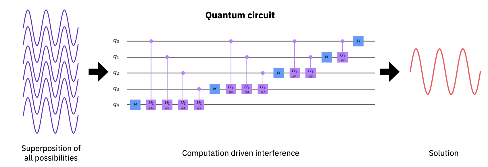
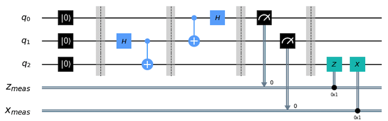

.. _qc-intro:

===============================
Quantum computing in a nutshell
===============================

Quantum computing represents a new paradigm in computation that utilizes the fundamental
principles of quantum mechanics to perform calculations.  If you are reading this then you
have undoubtedly heard that the promise of quantum computation lies in the possibility of
efficiently performing a handful of tasks such as prime factorization and quantum simulation;
computations that at size are beyond the capabilities of even the largest of classical computers.

The power of quantum computing rests on two cornerstones of quantum mechanics, namely
:ref:`superposition <qc-intro-superposition>` and
:ref:`entanglement <qc-intro-entanglement>` that highlight the wave- and particle-like aspects
of quantum computation, respectively.

.. _qc-intro-superposition:

Superposition
=============

Like a classical computer, a quantum computer operates on bits.  However, while classical bits can
only be found in the states 0 and 1, a quantum bit, or qubit, can represent the values 0 and 1,
or linear combinations of both.  These linear combinations are known as **superpositions**
(or superposition states) and allow for representing, and processing, exponentially many
logical states at once.

To see how this resource is utilized in quantum computation we first turn toward a classical
analog: noise cancellation.  Noise cancellation, as done in noise cancelling headphones for example,
is performed by utilizing the principle of superposition and interference to reduce the amplitude
of unwanted noise by generating a tone of approximately the same frequency and amplitude, but out
of phase by a value of :math:`\pi` (or any other odd integer of :math:`\pi`).

.. figure:: images/noise_cancel.png
   :scale: 40 %
   :align: center

   Approximate cancellation of a noise signal by a tone of nearly equal amplitude
   and offset by a phase of :math:`\sim \pi`.

As shown above, when the phase difference is close to an odd multiple of :math:`\pi`,
the superposition of the two waves results in interference, and an output that is
significantly reduced compared to the original.  The result is the signal of interest
unincumbered by noise. Although this processing is done by digital circuits, the amplitude
and phase are continuous variables that can never be matched perfectly, resulting in
incomplete correction.

A general computation on a quantum computer proceeds in very much the same way as
noise cancellation. To begin, one prepares a superposition of all possible computation
states.  This is then used as an input to a :ref:`quantum circuit <qc-intro-circuits>` that
selectively interferes the components of the superposition according to a prescribed algorithm.
What remains after cancelling the relative amplitudes and phases of the input state is the
solution to the computation performed by the quantum circuit.

   Quantum computation as an interference generation process.

.. _qc-intro-entanglement:

Entanglement
============

The second principle of quantum mechanics that quantum computation can utilize is the
phenomena of **entanglement**.  Entanglement refers to states of more than one qubit
(or particles in general) in which the combined state of the qubits contains more
information than the qubits do independently.  The overwhelming majority of multi-qubit quantum
states are entangled, and represent a valuable resource.  For example, entangled states between
qubits can be used for quantum teleportation (quantum circuit below), where a shared entangled
state of two qubits can be manipulated to transfer information from one qubit to another,
regardless of the relative physical proximity of the qubits.

   Quantum state teleportation circuit.

Entangled states as natural states of quantum systems are also of importance in disciplines
such as quantum chemistry and quantum simulation where the solution(s) often take the form
of highly-entangled multi-qubit states.  One can also utilize highly-entangled quantum states
of multiple qubits to, for example, generate certifiably random numbers.  There is even a `Qiskit
package <https://qiskit-rng.readthedocs.io/en/latest/>`_ to do this!

.. _qc-intro-circuits:

Quantum circuits
================

Quantum circuits are the common language of quantum computing.  A **quantum circuit** is a
computational routine consisting of coherent quantum operations on quantum data, such as that
held in qubits, and concurrent real-time classical computation. Such a circuit is an ordered
sequence of quantum gates, measurements, and resets, that may be conditioned on and use data
from the real-time classical computation. A set of quantum gates is said to be universal if
any unitary (information preserving) transformation of the quantum data can be efficiently
approximated arbitrarily well as a sequence of gates in the set. The quantum data held in
the qubits obeys special rules regarding its structure, and "unitary" is a mathematical
term that says that the transformation respects these rules.

Quantum circuits enable a quantum computer to take in classical information and output a
classical solution, leveraging quantum principles such as
:ref:`superposition <qc-intro-superposition>` and
:ref:`entanglement <qc-intro-entanglement>` to perform the computation.
A quantum algorithm workflow then consists of:

- The problem we want to solve,
- A classical algorithm that generates a description of a quantum circuit,
- The quantum circuit that needs to be run on quantum hardware,
- And the output classical solution to the problem that it produces.

Some workloads contain an extended sequence of interleaved quantum circuits and classical
computation, for example variational quantum algorithms execute quantum circuits within an
optimization loop. For these workloads, system performance increases substantially if the
transitions between circuit execution and non-current classical computation are made efficient.
Consequently, we define **near-time computation** to refer to computations with algorithms that make
repeated use of quantum circuits with hardware developed to speed up the computation time. In
near-time computation, the classical computation occurs on a time scale longer than the coherence
of the quantum computation. Contrast this with **real-time computation**, where the classical
computation occurs within the decoherence time of the quantum device.

Here's we return to the quantum teleportation circuit introduced earlier.

.. figure:: images/teleportation_detailed.png
   :align: center

   Quantum state teleportation circuit revisited.

Without loss of generality, quantum data can be represented by qubits. In the diagram above,
each horizontal line, or wire represents a qubit, with the left end of the wire being the
initial quantum data, and the right being the final quantum data generated by the quantum
circuit's computation. Quantum operators can be placed on these wires, and are represented
by boxes. They are functions mapping input quantum data to output quantum data by some
predefined rule. The empty wire is an operator - the identity operator - producing identical
quantum data to that which was passed into it. The simplest versions of these operators are
called **gates**. With a qubit written in terms of the computational basis states
:math:`|0\rangle` and :math:`|1\rangle`, analogous to the 0 and 1 states of a classical
bit, we can define the :math:`X` operator, also called the "Pauli X-gate", to be a quantum
gates that takes a qubit in the initial state :math:`|0\rangle` to final state
:math:`|1\rangle`, and vice versa. For trivial cases such as this, it can be considered
similar to a classical bit flip. However, the richness of quantum data lies in its ability
to go beyond the confines of these classical states, and explore a computational space that
includes superpositions of these basis states. These states possess a phase, or hidden information
about the state, that can only be revealed by performing deliberate quantum operations.
 
We can manipulate phase by the :math:`Z` operator, called the "Pauli Z gate" or sometimes the
"phase flip gate." Phase is a deeply mysterious but critical part of quantum information
and quantum mechanics. Something special about these operators is that they can sometimes
be performed partially, meaning we can go halfway through a bit or phase flip and stop.
These operations are called parameterized operations, and are represented by gates with
function-style parentheses, such as :math:`rX(\theta)`. The :math:`rX` gate is the
parameterized version of our :math:`X` gate, where we define :math:`rX(\pi)` to be the
full Pauli :math:`X` gate, or :math:`rX(\theta)` is an :math:`X_{\rm 90}`
gate (i.e. applying two will result in an :math:`X` gate), etc.
 
We can also define operators which apply over multiple bits, represented by boxes with
lines extending vertically from them to other wires in the circuit. For example, the
"CX gate," represented by the vertical line starting at some "control" wire and ending
with :math:`\oplus` on some "target" wire, performs a state evolution conceptually similar to a
classical XOR. This and the operators above (as well as the :math:`H`, :math:`S`, :math:`T`,
and :math:`Y` operators you see on the circuit) are interesting in that they are coherent,
meaning that there is no entropy generation as a result of their application. They are
reversible and the prior state of the data in the circuit could be reconstructed if desired.
 
Alternatively, we can also introduce decoherent operators, notably measurement, which do
not abide by this rule of "conservation of information." "Measurement", represented by
the meter symbol in a box with a line connecting to a "target" wire, destroy enough
information about a qubit's state, including the phase, to be able to represent it as
a classical bit and write that classical bit onto the target wire (often a fully classical
wire in some readout device). This is the typical way to extract information from the
quantum data into a classical device.
 
Note that with only :math:`H`, :math:`rZ`, :math:`CX`, and measurement gates, i.e. a universal
gate set, we can construct any quantum circuit, including those efficiently computing the dynamics
of any physical system in nature.
