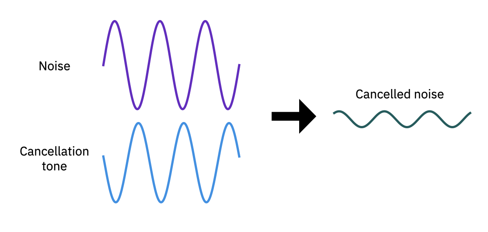
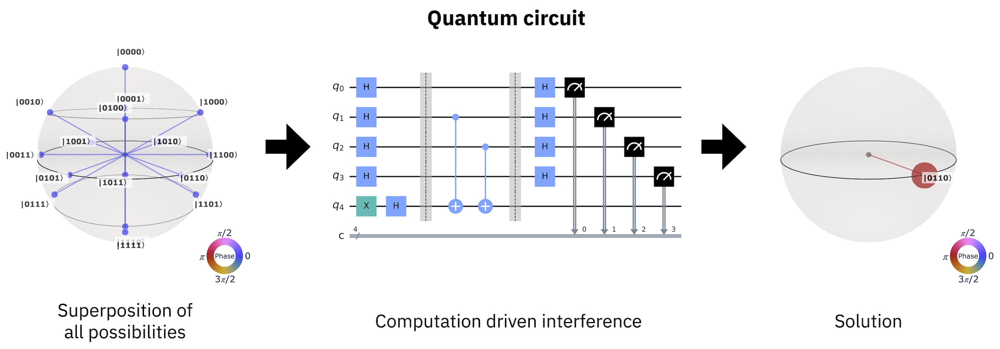
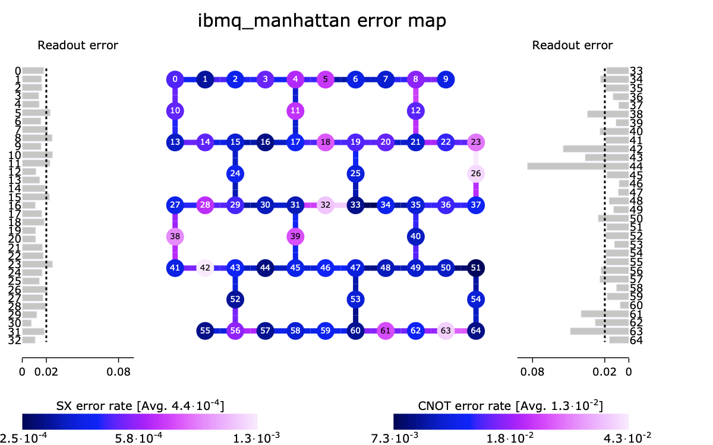

### ***IBM Quantum End User Agreement***
 

PLEASE READ CAREFULLY: This IBM Quantum End User Agreement is between you (“You”),  and IBM, and consists of (a) the terms of this IBM Quantum End User Agreement, (b) the IBM Privacy Policies (defined below), and (c) the authorizations and related instructions indicated on Your IBM Quantum account page listing the specific IBM Quantum resources You are permitted to use (referred to herein as “Authorization Instructions”) (collectively, this “Agreement”).

 

By accepting this Agreement on the IBM Quantum webpages, You (i) accept the terms of this Agreement, as may be amended from time to time as provided below and subject to the “Applicability” terms in Article 1.1 below, (ii) understand that You are entering a binding legal agreement, and (iii) are at least 18 years old.

 

If You are under 14, You may not access IBM Quantum.

 

If You are between 14 and 17 years old, then Your parent or legal guardian must accept this Agreement for You. By doing so, Your parent or legal guardian represents and warrants s/he has the legal right to do so, understands that this is a binding legal agreement, and accepts these terms on Your behalf.

 

This Agreement replaces all prior versions of the “IBM Q End User Agreement”, “IBM Q End User License Agreement” and the “IBM Q Experience End User License Agreement” and any previously linked “Terms of Use” or “Acceptable Use Policy”.

 

1. General. This Agreement and Your license (described below) governs Your use of IBM Quantum. You may withdraw from this program at any time by deleting Your IBM Quantum account from your account profile page. IBM may withdraw this program via termination of Your account. IBM may change the terms of this Agreement at any time. If You do not agree to the updated terms, please do not further access IBM Quantum.

 

1.1  Applicability. If Your access and use of IBM Quantum is governed and authorized by the terms of a Governing Contract with IBM, then the terms of the Governing Contract will apply. 

 

1.2  Definitions. The following defined terms are used in this Agreement: 

a.    “Content” means all data, software, and information You provide or input to IBM Quantum, including Quantum Inputs.

b.   “Governing Contract” means a contract between IBM and an IBM Quantum Client under which You are directly or indirectly obligated to IBM, including through Your employer, university or institution.

c.    "IBM" means International Business Machines Corporation, a New York Corporation, or one of its subsidiaries.

d.   “IBM Privacy Policies” means the IBM Privacy Statement and the IBM Online Privacy Statement linked therein (or other locations as IBM may designate).

e.    "IBM Quantum" means and may include actual quantum systems and the hardware, software, and web based applications required to use them. IBM Quantum may include, but is not limited to, (i) application programming interfaces (“API”), (ii) graphical user interfaces (“GUI”) (iii) quantum software development kits (“SDK”), (iv) quantum simulators and emulators, (v) Quantum Inputs, (vi) applications to administer access to IBM Quantum, (vii) applications to consume IBM Quantum resources, (viii) applications to execute programs on quantum computers and (ix) related webpages.

f.     “IBM Quantum Client” means an entity that entered into a Governing Contract with IBM for access to and use of IBM Quantum by, among others, You. An IBM Quantum Client may be Your employer (where You are an employee), university or other academic institution (where You are a student, teacher, professor or other associated), or customer (where You or Your employer is a contractor or other service provider of such customer).

g.    “Parties” means You and IBM collectively, and references to “Party” may individually refer to “You” or “IBM” as the context dictates.

h.   “Quantum Inputs” means input to IBM Quantum either via a GUI, API or SDK. This includes, but is not limited, to (i) one or more quantum circuits that describe which quantum gates to execute, (ii) input that specifies parameters for how to run a program that uses a quantum system, quantum simulator or quantum emulator, or (iii) inputs that directly or indirectly specify instructions for how IBM Quantum should operate.

 

2. Licenses.

a.   IBM Quantum is owned by IBM, including all rights, title and interest.

b.  All intellectual property rights and title to pre-existing materials are unaffected by this Agreement.
c. You own all Quantum Inputs You create and own Your results from using IBM Quantum. 

d.   For the term of this Agreement, IBM grants You a limited, nonexclusive, nontransferable license to access and use IBM Quantum for research, education, testing, evaluation and feedback purposes, all provided that You:

              I.       reproduce all intellectual property notices and other legends of ownership on each copy, or partial copy, of any IBM information downloaded from IBM Quantum websites;

             II.       do not use IBM Quantum for commercial purposes;  and  

            III.       remain in compliance with all terms and conditions of this Agreement.

e.   You may choose to provide feedback to IBM at your option. You grant to IBM a perpetual, fully paid up, irrevocable, nonexclusive, worldwide license to such feedback to use, execute, display, reproduce, make, perform, disclose, prepare derivative works from, and distribute, sell and transmit (internally and externally) such feedback and derivative works therefrom for any purpose. This includes the right of IBM to sublicense these rights to any third-party without consent or accounting by IBM to You. You represent that any feedback provided to IBM is original and that no part of such feedback violates any intellectual property rights of any third party.

f. Excluding any IBM logos or trademarks, IBM gives you permission to use results from Your Quantum Inputs displayed on IBM Quantum web based applications, including by screen capture, provided that You cite the source as “created using IBM Quantum”.

 

3. Confidentiality.

a.         Both Parties agree that all information exchanged under this Agreement is non-confidential. If either Party requires the exchange of confidential information, it will be made under a separate signed confidentiality agreement.

 

4. No Warranties.

Subject to any statutory warranties which cannot be excluded and may apply to You (such warranties are limited in duration to the minimum period permitted under applicable law), IBM Quantum is provided AS IS and IBM makes no warranties, express or implied, regarding IBM Quantum, or support thereof, including, but not limited to, any implied warranties or conditions of merchantability, satisfactory quality, fitness for a particular purpose, and title, and any warranty or condition of non-infringement. Results are not guaranteed and IBM makes no representation on the availability of IBM Quantum and any associated services.

 

5. Limitation of Liability.

 

5.1 Items for Which IBM May Be Liable. IBM’s entire liability for all claims in the aggregate arising from or related to this Agreement or any harm or otherwise arising under this Agreement will not exceed the amount of any (1) damages for bodily injury (including death) and damage to real property and tangible personal property, (2) other actual direct damages up to U.S. $10,000 (or equivalent in local currency), and (3) damages that cannot be limited under applicable law. This limit also applies collectively to IBM, its affiliates, contractors, and suppliers, and is the maximum for which they are collectively responsible.

 

5.2 Items for Which IBM Is Not Liable. Under no circumstances will IBM, even if informed about the possibility of the following, be liable for: special, incidental, exemplary, indirect, or economic consequential damages; lost profits, business value, revenue, goodwill, or anticipated savings; or loss of or damage to data.

The disclaimers and exclusions in this Agreement also apply to IBM's affiliates, contractors, and suppliers. Providers of non-IBM products and services may provide their own warranties. IBM has no responsibility for claims based on non-IBM products and services, or any violation of law or third-party rights caused by Your Content.

 

6.    Personal Data

a. IBM, its affiliates, and contractors of either, may, wherever they do business, store and otherwise process Your personal identifiable information (PII), as detailed at the IBM Quantum Privacy Page), for the purposes and the duration in the IBM Quantum Privacy Page.

The IBM Privacy Policies provide additional details. By accepting this Agreement, You are giving IBM Your consent to collect, access, store and use the PII specified in this Article 6, all in accordance with this Agreement (including the IBM Privacy Policies and the IBM Quantum Privacy Page).

b. You may withdraw consent at any time by notifying IBM via Your IBM Quantum account page or as detailed in the “Data Retention” portion of the IBM Quantum Privacy Page.

c. You represent that You will not provide IBM with any personally identifiable information that relates to or identifies an individual, other than the PII specified in this Article 6.

 

7.    Miscellaneous

a.   IBM may terminate, suspend, revoke or limit Your access to IBM Quantum at IBM’s discretion.

b. IBM Quantum may not be used for unlawful, obscene, offensive or fraudulent activity, such as advocating or causing harm, interfering with or violating the integrity or security of a network or system, evading filters, sending unsolicited, abusive, deceptive or disparaging messages, viruses or harmful code, or violating third party rights. In addition, IBM may remove or refuse to accept or use any Content without limitation.

c.   You may not reverse engineer or otherwise attempt to discover or decode any hardware component of IBM Quantum.

d.  You may not use IBM Quantum in any application or situation where failure could lead to death or serious bodily injury of any person, or to severe physical or environmental damage, such as aircraft, motor vehicles or mass transport, nuclear or chemical facilities, life support or medical equipment, or weaponry systems.

e.  You will not use IBM Quantum in any way that harms IBM, IBM Quantum, other users of IBM Quantum, or other computer systems, and intellectual property rights therein. You will promptly notify IBM if You discover or suspect that Content may harm IBM Quantum or its users, and will fully cooperate with IBM’s efforts to protect IBM Quantum and its users.

f.   You will not circumvent any restrictions placed on Your account, including employing practices to mask Your physical location.

g.   Each Party agrees to comply and reasonably assist the other in complying with applicable government export and import laws and regulations including those of the United States. You agree that You will not access IBM Quantum in a manner contrary to U.S. or other applicable export, embargo, and sanctions regulations, including restrictions related to certain end uses and end users. Further, both Parties will not directly or indirectly export or re-export, at any time, any technology, software and/or commodities furnished through this Agreement, or its direct product, to any prohibited country (including release of technology, software and/or commodities to nationals, wherever they may be located, of any prohibited country) as specified in applicable export, embargo, and sanctions regulations.

h.  You represent that Content will not, in whole or part, be (1) regulated data of any kind, including but not limited to sensitive healthcare or financial data, (2) Content controlled under the U.S. International Traffic in Arms Regulation (ITAR) or the defense trade control regime of any country, (3) Content that requires an export license under applicable export control laws, or (4) Content described on the Commerce Control List of the U.S. Export Administration Regulations or the dual-use control list of any country.

i.    You acknowledge that IBM may use personnel in locations worldwide to support the delivery of IBM Quantum.

j.    Neither Party is responsible for failure to fulfill any obligations due to causes beyond its control.

k.   Except as explicitly provided in this Agreement, this Agreement does not grant any licenses, either directly or indirectly, by implication, estoppel or otherwise, to either Party under any patent, copyright or other intellectual property right of the other Party.

l.    This Agreement does not confer any right to use in advertising, publications or promotional activities, or otherwise, any IBM owned name, trade name, trademarks, logos, or other designations, including any contraction, abbreviation or simulation of any of the foregoing.

m. You may not assign this Agreement, in whole or in part, without IBM's prior written consent. Any attempt to do so is void.

n.  Any terms of this Agreement that by their nature extend beyond termination of this Agreement remain in effect until fulfilled, and apply to both Parties' respective successors and assignees.

o.  Neither Party is a legal representative nor legal agent or partner of the other, and this Agreement does not create a joint venture between the Parties. IBM may enter into similar agreements with others and independently develop, acquire and market materials, products and services that may be competitive with You or Your employer’s products or services.

p.  If any provision of this Agreement is held to be invalid or unenforceable, the remaining provisions of this Agreement remain in full force and effect.

q.  Each Party will allow the other reasonable opportunity to comply before it claims that the other has not met its obligations under this Agreement. The Parties will attempt to resolve disputes or claims relating to this Agreement in good faith.

r.   Unless otherwise required by applicable law without the possibility of contractual waiver or limitation: (1) neither Party will bring a legal action, regardless of form, for any claim arising out of or related to this Agreement more than two years after the cause of action arose; and (2) upon the expiration of such time limit, any such claim and all respective rights related to the claim lapse.

s.   No right or cause of action for any third-party is created by this Agreement, nor is IBM responsible for any third-party claims against You, except as permitted in Article 5.1 “Items for Which IBM May Be Liable” above.

t.   This Agreement and all related claims shall be governed by the laws of the State of New York, U.S.A., without regard to its conflict and choice-of-law principles. You consent to the exclusive jurisdiction and venue of the U.S. federal or state courts in New York, U.S.A., to resolve disputes or claims related to this Agreement. The Parties expressly waive the right to trial by jury in any matter which arises under this Agreement. Nothing in this Agreement affects statutory rights that cannot be waived or limited by contract. The United Nations Convention on Contracts for the International Sale of Goods does not apply to transactions under this Agreement.

u. This Agreement is the complete agreement between the Parties regarding its subject matter and supersedes any prior oral or written communications or understandings between the Parties related to its subject matter.

 figure:: images/qiskit_nutshell.png
   :scale: 50 %
   :align: center

.. _qc-intro:

===============================
Quantum computing in a nutshell
===============================

Quantum computing represents a new paradigm in computation that utilizes the fundamental
principles of quantum mechanics to perform calculations.  If you are reading this then you
have undoubtedly heard that the promise of quantum computation lies in the possibility of
efficiently performing a handful of tasks such as prime factorization, quantum simulation, search,
optimization, and algebraic programs such as machine learning; computations that at size are
beyond the capabilities of even the largest of
classical computers.

The power of quantum computing rests on two cornerstones of quantum mechanics, namely
:ref:`interference <qc-intro-interference>` and
:ref:`entanglement <qc-intro-entanglement>` that highlight the wave- and particle-like aspects
of quantum computation, respectively.  Qiskit is an SDK for performing quantum computations
that utilize these quantum mechanical principles using the language of
:ref:`quantum circuits <qc-intro-circuits>`.  Comprised of quantum gates, instructions, and
classical control logic, quantum circuits allow for expressing complex algorithms
and applications in a abstract manner that can be executed on a quantum computer.  At its
core, Qiskit is a quantum circuit construction, optimization, and execution engine.
Additional algorithm and application layers leverage quantum circuits, often in concert
with classical computing resources, to solve problems in optimization, quantum chemistry,
physics, machine learning, and finance.  In what follows, we give a very brief overview
of quantum computing, and how Qiskit is used at each step.  Interested readers are
directed to additional in-depth materials for further insights.

.. _qc-intro-interference:

Interference
============

Like a classical computer, a quantum computer operates on bits.  However, while classical bits can
only be found in the states 0 and 1, a quantum bit, or qubit, can represent the values 0 and 1,
or linear combinations of both.  These linear combinations are known as superpositions
(or superposition states).

To see how this resource is utilized in quantum computation we first turn to a classical
analog: noise cancellation.  Noise cancellation, as done in noise cancelling headphones
for example, is performed by employing superposition and the principle of **interference**
to reduce the amplitude of unwanted noise by generating a tone of approximately the same
frequency and amplitude, but out of phase by a value of :math:`\pi` (or any other odd
integer of :math:`\pi`).

   Approximate cancellation of a noise signal by a tone of nearly equal amplitude
   and offset by a phase of :math:`\sim \pi`.

As shown above, when the phase difference is close to an odd multiple of :math:`\pi`,
the superposition of the two waves results in interference, and an output that is
significantly reduced compared to the original.  The result is the signal of interest
unencumbered by noise. Although this processing is done by digital circuits, the amplitude
and phase are continuous variables that can never be matched perfectly, resulting in
incomplete correction.

A general computation on a quantum computer proceeds in very much the same way as
noise cancellation. To begin, one prepares a superposition of all possible computation
states.  This is then used as an input to a :ref:`quantum circuit <qc-intro-circuits>` that
selectively interferes the components of the superposition according to a prescribed algorithm.
What remains after cancelling the relative amplitudes and phases of the input state is the
solution to the computation performed by the quantum circuit.

   Quantum computation as an interference generation process.

.. _qc-intro-entanglement:

Entanglement
============

The second principle of quantum mechanics that quantum computation can utilize is the
phenomena of **entanglement**.  Entanglement refers to states of more than one qubit
(or particles in general) in which the combined state of the qubits contains more
information than the qubits do independently.  The overwhelming majority of multi-qubit quantum
states are entangled, and represent a valuable resource.  For example, entangled states between
qubits can be used for quantum teleportation, where a shared entangled
state of two qubits can be manipulated to transfer information from one qubit to another,
regardless of the relative physical proximity of the qubits. Entangled states, as natural
states of quantum systems, are also of importance in disciplines
such as quantum chemistry and quantum simulation where the solution(s) often take the form
of entangled multi-qubit states.  One can also utilize highly-entangled quantum states
of multiple qubits to, for example, generate certifiably random numbers.  There is even a `Qiskit
package <https://qiskit-rng.readthedocs.io/en/latest/>`_ to do this!

.. _qc-intro-circuits:

Quantum circuits
================

Algorithms and applications that utilize quantum mechanical resources can be easily and efficiently
written in the language of **quantum circuits**. A quantum circuit is a
computational routine consisting of coherent quantum operations on quantum data, such as that
held in qubits, and concurrent real-time classical computation. Each horizontal line, or wire
in a circuit represents a qubit, with the left end of the wire being the
initial quantum data, and the right being the final quantum data generated by the quantum
circuit's computation. Operations on qubits can be placed on these wires, and are represented
by boxes.

.. figure:: images/teleportation_detailed.png
   :align: center

   Quantum state teleportation circuit revisited.

Quantum circuits enable a quantum computer to take in classical information and output a
classical solution, leveraging quantum principles such as
:ref:`interference <qc-intro-interference>` and
:ref:`entanglement <qc-intro-entanglement>` to perform the computation.

A typical quantum algorithm workflow consists of:

- The problem we want to solve,
- A classical algorithm that generates a description of a quantum circuit,
- The quantum circuit that needs to be run on quantum hardware,
- And the output classical solution to the problem that it produces.

Quantum gates form the primitive operations on quantum data.  Quantum gates represent
information preserving, reversible transformations on the quantum data stored in qubits.
These "unitary" transformations represent the quantum mechanical core of a quantum
circuit.  Some gates such as :math:`X` (also written as :math:`\oplus`) and :math:`CX`
have classical analogs such as bit-flip and :math:`XOR` operations, respectively,
while others do not.  The Hadamard (:math:`H`) gate, along with the parameterized rotates
:math:`rX(\theta)` and :math:`rY(\theta)`, generate superposition states,
while gates such as :math:`Z`, :math:`rZ(\theta)`, :math:`S`, and :math:`T` impart phases that
can be used for interference.  Two-qubit gates like the :math:`CX` gate are used
to generate entanglement between pairs of qubits, or to "kick" the phase from
one qubit to another.   In contrast to gates, operations like "measurement", represented by
the meter symbol in a box with a line connecting to a "target" wire, extract partial
information about a qubit's state, often losing the phase, to be able to represent it as
a classical bit and write that classical bit onto the target wire (often a fully classical
wire in some readout device). This is the typical way to take information from the
quantum data into a classical device.  Note that with only :math:`H`, :math:`rZ(\theta)`,
:math:`CX`, and measurement gates, i.e. a universal gate set, we can construct any quantum circuit,
including those efficiently computing the dynamics of any physical system in nature.

Some workloads contain an extended sequence of interleaved quantum circuits and classical
computation, for example variational quantum algorithms execute quantum circuits within an
optimization loop. For these workloads, system performance increases substantially if the
quantum circuits are parameterized, and transitions between circuit execution and non-current
classical computation are made efficient.
Consequently, we define **near-time computation** to refer to computations with algorithms that make
repeated use of quantum circuits with hardware developed to speed up the computation time. In
near-time computation, the classical computation occurs on a time scale longer than the coherence
of the quantum computation. Contrast this with **real-time computation**, where the classical
computation occurs within the decoherence time of the quantum device.

Constructing complex quantum circuits with minimal effort is at the heart of Qiskit.
With only a few lines of code, it is possible to construct complex circuits like the
one above

.. jupyter-execute::
   :hide-code:

   from qiskit import *

.. jupyter-execute::
   :hide-output:

   qr = QuantumRegister(3, 'q')
   cr = ClassicalRegister(2, 'zx_meas')
   qc = QuantumCircuit(qr,cr)
   qc.reset(range(3))
   qc.barrier()
   qc.h(1)
   qc.cx([1,0],[2,1])
   qc.h(0)
   qc.barrier()
   qc.measure([0,1], [0,1])
   qc.barrier()
   qc.z(2).c_if(cr, 1)
   qc.x(2).c_if(cr, 2)

that support a rich feature set of operations, and can be passed to a range of
:ref:`quantum computers <qc-intro-computers>` or classical simulators.

.. _qc-intro-computers:

Quantum computers
=================

   A view inside the IBM Quantum System One.

Quantum computers which are programmed using quantum circuits can be constructed out of any
quantum technology that allows for defining qubit elements, and can implement
single- and multi-qubit gate operations with high-fidelity. At present, architectures
based on superconducting circuits, trapped-ions, semiconducting quantum-dots, photons, and
neutral atoms, are actively being developed, and many are accessible to users over the internet.
Qiskit is agnostic with respect to the underlying architecture of a given quantum system,
and can compile a quantum circuit to match the entangling gate topology of a quantum device,
map the circuit instructions into the native gate set of the device, and optimize the resulting
quantum circuit for enhanced fidelity.

As with the noise cancellation example above, the amplitude and phase of qubits are continuous
degrees of freedom upon which operations can never be done exactly.  These gates errors, along
with noise from the environment in which a quantum computer resides, can conspire to ruin a
computation if not accounted for in the compilation process, and may require additional
mitigation procedures in order to obtain a high-fidelity output on present day
quantum systems susceptible to noise.  Qiskit is capable of taking into account a wide range of
device calibration metrics (see figure below) in its compilation strategy, and can select an
optimal set of qubits on which to run a given quantum circuit.  In addition, Qiskit hosts a
collection of noise mitigation techniques for extracting a faithful representation of a quantum
circuits output.

   Topology and error rates for the IBM Quantum *ibmq_manhattan* system.

Where to go from here
======================

Hopefully we have given the reader a taste of what quantum computation has to offer
and you are hungry for more.  If so, there are several resources that may be of
interest:

- `Getting started with Qiskit <getting_started.html>`_ - Dive right into Qiskit.

- `Field guide to quantum computing <https://quantum-computing.ibm.com/docs/iqx/guide/>`_ : A gentle
  physics-based introduction written by some of the founders of quantum computation that makes use
  of the interactive circuit composer.

- `Qiskit textbook <https://qiskit.org/textbook>`_ : A university quantum algorithms/computation
  course supplement based on Qiskit.
