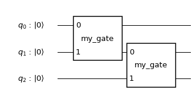
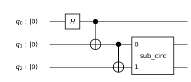
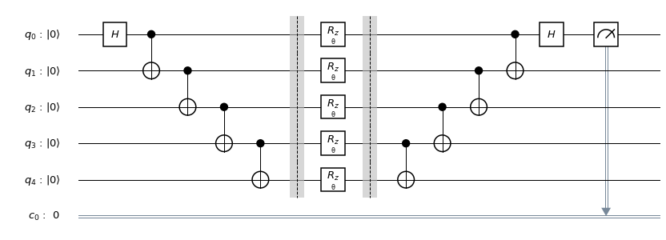
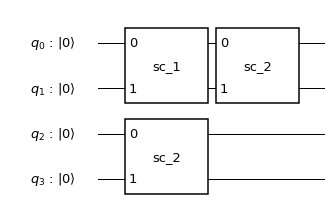
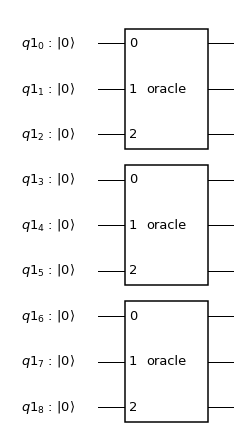
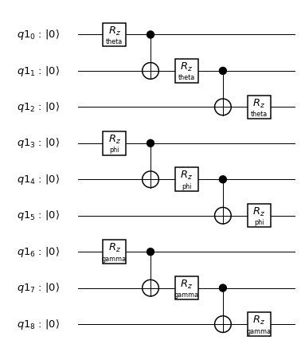
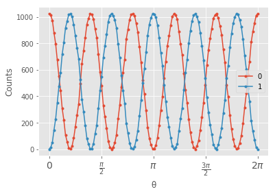

============
Custom gates
============

------------
Opaque Gates
------------

The ``Gate`` and ``Instruction`` constructors  accept an integer number of
qubits (``num_qubits``) and an integer number of bits (``num_cbits``) which
define the gate's quantum and classical width.

.. code:: python

  from qiskit.circuit import Gate

  my_gate = Gate(name='my_gate', num_qubits=2, params=[])

An ``append(instruction, qargs, cargs)`` method has been added to the
``QuantumCircuit`` class, which takes an anonymous ``Instruction`` instance and
attaches it to the circuit at the specified ``qargs`` and `cargs`.

.. code:: python

  qr = QuantumRegister(3, 'q')
  circ = QuantumCircuit(qr)
  circ.append(my_gate, [qr[0], qr[1]])
  circ.append(my_gate, [qr[1], qr[2]])

  circ.draw(output='mpl')

---------------
Composite Gates
---------------

Composite gates and complex circuit components are constructed and managed as
independent ``QuantumCircuits`` and, through the ``to_instruction`` method,
converted to ``Instructions`` to be appended to a target circuit at a given
location.

.. code:: python

  # Build a sub-circuit
  sub_q = QuantumRegister(2)
  sub_circ = QuantumCircuit(sub_q, name='sub_circ')
  sub_circ.h(sub_q[0])
  sub_circ.crz(1, sub_q[0], sub_q[1])
  sub_circ.barrier()
  sub_circ.iden(sub_q[1])
  sub_circ.u3(1, 2, -2, sub_q[0])

  # Convert to a gate and stick it into an arbitrary place in the bigger circuit
  sub_inst = sub_circ.to_instruction()

  ​q = QuantumRegister(3, 'q')
  circ = QuantumCircuit(q)
  circ.h(qr[0])
  circ.cx(qr[0], qr[1])
  circ.cx(qr[1], qr[2])
  circ.append(sub_inst, [q[1], q[2]])

  circ.draw(output='mpl')

Circuits are not immediately decomposed upon conversion ``to_instruction`` to
allow circuit design at higher levels of abstraction. When desired, or before
compilation, sub-circuits will be decomposed via the `decompose` method.

.. code:: python

  decomposed_circ = circ.decompose() # Doesn't modify original
  decomposed_circ.draw(output='mpl')

.. image:: ../images/figures/custom_gates_2.png
  :alt: Decomposed quantum circuit with 7 gates.

-------------------
Parameterized Gates
-------------------

Parameterization is a common feature of many quantum algorithms, as well as a
standard building block for constructing libraries of standard gates and
sub-circuits.

The ``Parameter`` class which can be used to specify a place-holder wherever
a numeric parameter can be used.

You can use parameterized gates to quickly construct a series of experiments
which will vary the angle of a global :math:`R_z` rotation over a set of
entangled qubits.

.. code:: python

  from qiskit.circuit import Parameter

  theta = Parameter('θ')

  n = 5

  qc = QuantumCircuit(5, 1)

  qc.h(0)
  for i in range(n-1):
      qc.cx(i, i+1)

  qc.barrier()
  qc.rz(theta, range(5))
  qc.barrier()

  for i in reversed(range(n-1)):
      qc.cx(i, i+1)
  qc.h(0)
  qc.measure(0, 0)

  qc.draw(output='mpl')

You can inspect the circuit's ``parameters`` property.

.. code:: python

  print(qc.parameters)

.. code-block:: text

  {Parameter(θ)}

^^^^^^^^^^^^^^^^^^^^^^^^^^^^^^^^
Combining Parameterized Circuits
^^^^^^^^^^^^^^^^^^^^^^^^^^^^^^^^

Parameterized circuits can be composed like standard ``QuantumCircuit``\s.
Generally, when composing two parameterized circuits, the resulting circuit will
be parameterized by the union of the parameters of the input circuits.

However, parameter names must be unique within a given circuit. When attempting
to add a parameter whose name is already present in the target circuit:

- if the source and target share the same ``Parameter`` instance, the
  parameters will be assumed to be the same and combined
- if the source and target have different ``Parameter`` instances, an error
  will be raised

.. code:: python

  phi = Parameter('phi')

  sub_circ1 = QuantumCircuit(2, name='sc_1')
  sub_circ1.rz(phi, 0)
  sub_circ1.rx(phi, 1)

  sub_circ2 = QuantumCircuit(2, name='sc_2')
  sub_circ2.rx(phi, 0)
  sub_circ2.rz(phi, 1)

  qc = QuantumCircuit(4)
  qr = qc.qregs[0]

  qc.append(sub_circ1.to_instruction(), [qr[0], qr[1]])
  qc.append(sub_circ2.to_instruction(), [qr[0], qr[1]])

  qc.append(sub_circ2.to_instruction(), [qr[2], qr[3]])

  qc.draw(output='mpl')

  # The following raises an error: "QiskitError: 'Name conflict on adding parameter: phi'"
  # phi2 = Parameter('phi')
  # qc.u3(0.1, phi2, 0.3, 0)

To insert a sub-circuit under a different parameterization, the
``to_instruction`` method accepts an optional argument (``parameter_map``)
which, when present, will generate instructions with the source parameter
replaced by a new parameter.

.. code:: python

  p = Parameter('p')
  qc = QuantumCircuit(3, name='oracle')
  qc.rz(p, 0)
  qc.cx(0, 1)
  qc.rz(p, 1)
  qc.cx(1, 2)
  qc.rz(p, 2)

  theta = Parameter('theta')
  phi = Parameter('phi')
  gamma = Parameter('gamma')

  qr = QuantumRegister(9)
  larger_qc = QuantumCircuit(qr)
  larger_qc.append(qc.to_instruction({p: theta}), qr[0:3])
  larger_qc.append(qc.to_instruction({p: phi}), qr[3:6])
  larger_qc.append(qc.to_instruction({p: gamma}), qr[6:9])
  larger_qc.draw(output='mpl')

    their own triple of qubits.

.. code:: python

  larger_qc.decompose().draw(output='mpl')

^^^^^^^^^^^^^^^^^^^^^^^^^^^^
Binding Parameters to Values
^^^^^^^^^^^^^^^^^^^^^^^^^^^^

All circuit parameters must be bound before sending the circuit to a backend.
This can be done in one of two ways:

#. The ``bind_parameters`` method accepts a dictionary mapping ``Parameters`` to
   values, and returns a new circuit with each parameter replaced by its
   corresponding value. Partial binding is supported, in which case the returned
   circuit will be parameterized by any ``Parameters`` which were not mapped to
   a  value.

   .. code:: python

     import numpy as np

     theta_range = np.linspace(0, 2 * np.pi, 128)

     circuits = [qc.bind_parameters({theta: theta_val})
               for theta_val in theta_range]

     print(circuits[-1].parameters)
     circuits[-1].draw(output='mpl')

   .. code-block:: text

     set()

   .. image:: ../images/figures/custom_gates_4.png
     :alt: Quantum circuit with 5 z-rotation gates each rotating by 2 pi.

#. ``qiskit.execute`` accepts a ``parameter_binds`` keyword argument which,
   when specified as a list of dictionaries mapping ``Parameters`` to values,
   will bind and execute a circuit on the backend for every mapping dictionary
   in the list.

   .. code:: python

     from qiskit import BasicAer, execute

     job = execute(qc,
                 backend=BasicAer.get_backend('qasm_simulator'),
                 parameter_binds=[{theta: theta_val}
                   for theta_val in theta_range])

     # Note: Bind labels aren't preserved in executions.
     counts = [job.result().get_counts(i)
       for i in range(len(job.result().results))]

In the example circuit, we apply a global :math:`R_z(\theta)`` rotation on
5-qubit entangled state and so expect to see oscillation in qubit-0 at
:math:`5\,\theta`.

.. code:: python

  %matplotlib inline
  import matplotlib.pyplot as plt
  plt.style.use('ggplot')

  fig = plt.figure()
  ax = fig.add_subplot(111)

  ax.plot(theta_range,
          list(map(lambda c: c.get('0', 0), counts)),
          '.-',
          label='0')
  ax.plot(theta_range,
          list(map(lambda c: c.get('1', 0), counts)),
          '.-',
          label='1')

  ax.set_xticks([i * np.pi / 2 for i in range(5)])
  ax.set_xticklabels(
      ['0', r'$\frac{\pi}{2}$', r'$\pi$', r'$\frac{3\pi}{2}$', r'$2\pi$'],
      fontsize=14)
  ax.set_xlabel('θ')
  ax.legend()
  plt.show()

    two curves are off by a relative phase of pi / 5.

^^^^^^^^^^^^^^^^^^^^^^^^^
Reducing Compilation Time
^^^^^^^^^^^^^^^^^^^^^^^^^

Compiling over a parameterized circuit prior to binding can, in some cases,
significantly reduce compilation time as compared to compiling over a set of
bound circuits.

.. code:: python

  import time
  from itertools import combinations
  from qiskit.compiler import transpile, assemble
  from qiskit.test.mock import FakeTokyo

  start = time.time()
  qcs = []

  theta_range = np.linspace(0, 2*np.pi, 32)

  for n in theta_range:
      qc = QuantumCircuit(5)

      for k in range(8):
          for i,j in combinations(range(5), 2):
              qc.cx(i,j)
          qc.rz(n, range(5))
          for i,j in combinations(range(5), 2):
              qc.cx(i,j)

      qcs.append(qc)

  compiled_circuits = transpile(qcs, backend=FakeTokyo())
  qobj = assemble(compiled_circuits, backend=FakeTokyo())

  end = time.time()
  print('Time compiling over set of bound circuits: ', end-start)

.. code-block:: text

  Time compiling over set of bound circuits:  75.6394031047821

.. code:: python

  start = time.time()
  qc = QuantumCircuit(5)
  theta = Parameter('theta')

  for k in range(8):
      for i,j in combinations(range(5), 2):
          qc.cx(i,j)
      qc.rz(theta, range(5))
      for i,j in combinations(range(5), 2):
          qc.cx(i,j)

  transpiled_qc = transpile(qc, backend=FakeTokyo())
  qobj = assemble([transpiled_qc.bind_parameters({theta: n})
                   for n in theta_range], backend=FakeTokyo())
  end = time.time()
  print('Time compiling over parameterized circuit, then binding: ', end-start)

.. code-block:: text

  Time compiling over parameterized circuit, then binding:  8.703618049621582
