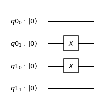
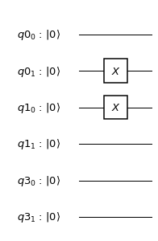
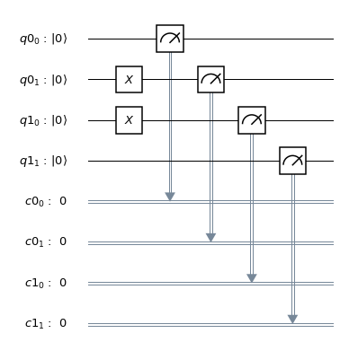
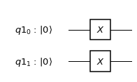
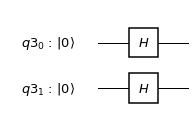
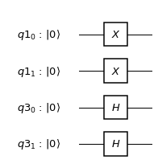
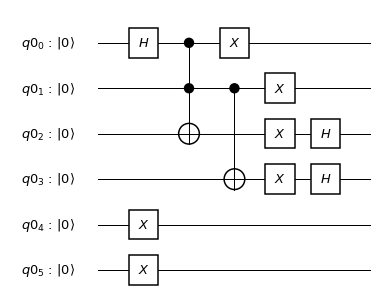

Circuits and Registers
======================

The ``QuantumCircuit``, ``QuantumRegister``, and ``ClassicalRegister``
are the main objects for Qiskit Terra. You can create custom circuits,
combine existing circuits, manipulate a circuit's structure,
and index into circuit elements.

The following imports will be used in the examples below.

.. code:: python

    import numpy as np
    from qiskit import QuantumCircuit, ClassicalRegister, QuantumRegister
    from qiskit import BasicAer, execute
    from qiskit.quantum_info import Pauli, state_fidelity, basis_state, process_fidelity

Constructing Registers
----------------------

Quantum and Classical Registers are declared using the following:

.. code:: python

    q0 = QuantumRegister(2, 'q0')
    c0 = ClassicalRegister(2, 'c0')
    q1 = QuantumRegister(2, 'q1')
    c1 = ClassicalRegister(2, 'c1')
    q_test = QuantumRegister(2, 'q0')

The name is optional. If not given Qiskit will name it ``qi`` where
``i`` is an integer which will count from 0. The name and size can
be returned using the following:

.. code:: python

    print(q0.name)
    print(q0.size)

.. parsed-literal::

    q0
    2

You can test if the register are the same or different.

.. code:: python

    q0==q0

.. parsed-literal::

    True

.. code:: python

    q0==q_test

.. parsed-literal::

    True

.. code:: python

    q0==q1

.. parsed-literal::

    False

Creating Circuits
-----------------

Quantum Circuits are made using registers. Either when initiated or by
using the ``add_register`` command.

.. code:: python

    circ = QuantumCircuit(q0, q1)
    circ.x(q0[1])
    circ.x(q1[0])
    circ.draw(output='mpl')

is the same as

.. code:: python

    circ2 = QuantumCircuit()
    circ2.add_register(q0)
    circ2.add_register(q1)
    circ2.x(q0[1])
    circ2.x(q1[0])
    circ2.draw(output='mpl')

.. note::

    The order of registers in the list is the order they are initiated
    or added **not** the tensor product for quantum registers.

.. code:: python

    from copy import deepcopy

    q3 = QuantumRegister(2, 'q3')
    circ3 = deepcopy(circ)
    circ3.add_register(q3)
    circ3.draw(output='mpl')

.. note::

    The circuit drawer has the last register added at the bottom and
    if we add a new register it will add it to the bottom of the circuit.

Concatenating Circuits
----------------------

In many situations you may have two circuits that you want to
concatenate together to form a new circuit. This is very useful when one
circuit has no measurements and the final circuit represents a
measurement.

.. code:: python

    meas = QuantumCircuit(q0, q1, c0, c1)
    meas.measure(q0, c0)
    meas.measure(q1, c1)

    qc = circ + meas

    qc.draw(output='mpl')

.. image:: ../images/figures/quantum_circuits_18_0.png

.. code:: python

    meas2 = QuantumCircuit()
    meas2.add_register(q0)
    meas2.add_register(q1)
    meas2.add_register(c0)
    meas2.add_register(c1)
    meas2.measure(q0, c0)
    meas2.measure(q1, c1)

    qc2 = circ2 + meas2

    qc2.draw(output='mpl')

.. code:: python

    circ4 = QuantumCircuit(q1)
    circ4.x(q1)
    circ4.draw(output='mpl')

.. code:: python

    circ5 = QuantumCircuit(q3)
    circ5.h(q3)
    circ5.draw(output='mpl')

The new register is added to the circuit:

.. code:: python

    (circ4+circ5).draw(output='mpl')

We have also overloaded ``+=`` to the ``QuantumCircuit`` object:

.. code:: python

    circ4 += circ5
    circ4.draw(output='mpl')

Examining Circuit Results
-------------------------

In the circuit output, the most significant bit (MSB) is to the left and
the least significant bit (LSB) is to the right (i.e. we follow the
regular computer science little endian ordering). In this example:

.. code:: python

    circ.draw(output='mpl')

qqubit register :math:`Q_0` is prepared in the state :math:`|10\rangle`
and :math:`Q_1` is in the state :math:`|01\rangle` giving a total state
:math:`|0110\rangle` (:math:`Q1\otimes Q0`).

.. note::

    The tensor order in Qiskit goes as :math:`Q_n \otimes .. Q_1 \otimes Q_0`

That is the four qubit statevector of length 16 with the 6th element
(``int('0110',2)=6``) being one. Note the element count starts from
zero.

.. code:: python

    backend_sim = BasicAer.get_backend('statevector_simulator')
    result = execute(circ, backend_sim).result()
    state = result.get_statevector(circ)
    print(state)

.. parsed-literal::

    [0.+0.j 0.+0.j 0.+0.j 0.+0.j 0.+0.j 0.+0.j 1.+0.j 0.+0.j 0.+0.j 0.+0.j
     0.+0.j 0.+0.j 0.+0.j 0.+0.j 0.+0.j 0.+0.j]

To check the fidelity of this state with the ``basis_state`` in Qiskit
Terra you can use:

.. code:: python

    state_fidelity(basis_state('0110', 4), state)

.. parsed-literal::

    1.0

We can also use Qiskit Terra to make the unitary operator representing
the circuit (provided there are no measurements). This will be a
:math:`16\times16` matrix equal to
:math:`I\otimes X\otimes X\otimes I`. To check this is correct we can
use the ``Pauli`` class and the ``process_fidelity`` function.

.. code:: python

    backend_sim = BasicAer.get_backend('unitary_simulator')
    result = execute(circ, backend_sim).result()
    unitary = result.get_unitary(circ)
    process_fidelity(Pauli(label='IXXI').to_matrix(), unitary)

.. parsed-literal::

    1.0

To map the information of the quantum state to the classial world we
have to use the example with measurements ``qc``:

.. code:: python

    qc.draw(output='mpl')

This will map the quantum state to the classical world and since the
state has no superpositions it will be deterministic and equal to
``'01 10'``. Here a space is used to separate the registers.

.. code:: python

    backend_sim = BasicAer.get_backend('qasm_simulator')
    result = execute(qc, backend_sim).result()
    counts = result.get_counts(qc)
    print(counts)

.. parsed-literal::

    {'01 10': 1024}

To show that it does not matter how you add the registers we run the
same as above on the second example circuit:

.. code:: python

    backend_sim = BasicAer.get_backend('statevector_simulator')
    result = execute(circ2, backend_sim).result()
    states = result.get_statevector(circ2)

    backend_sim = BasicAer.get_backend('qasm_simulator')
    result = execute(qc2, backend_sim).result()
    counts = result.get_counts(qc2)

    backend_sim = BasicAer.get_backend('unitary_simulator')
    result = execute(circ2, backend_sim).result()
    unitary = result.get_unitary(circ2)

.. code:: python

    print(counts)

.. parsed-literal::

    {'01 10': 1024}

.. code:: python

    state_fidelity(basis_state('0110', 4), state)

.. parsed-literal::

    1.0

.. code:: python

    process_fidelity(Pauli(label='IXXI').to_matrix(), unitary)

.. parsed-literal::

    1.0

Determining Circuit Resources
-----------------------------

A ``QuantumCircuit`` object provides methods for inquiring its resource
use. This includes the number of qubits, operations, and a few other
things.

.. code:: python

    q = QuantumRegister(6)
    circuit = QuantumCircuit(q)
    circuit.h(q[0])
    circuit.ccx(q[0], q[1], q[2])
    circuit.cx(q[1], q[3])
    circuit.x(q)
    circuit.h(q[2])
    circuit.h(q[3])
    circuit.draw(output='mpl')

.. code:: python

    # total number of operations in the circuit. no unrolling is done.
    circuit.size()

.. parsed-literal::

    11

.. code:: python

    # depth of circuit (number of ops on the critical path)
    circuit.depth()

.. parsed-literal::

    5

.. code:: python

    # number of qubits in the circuit
    circuit.width()

.. parsed-literal::

    6

.. code:: python

    # a breakdown of operations by type
    circuit.count_ops()

.. parsed-literal::

    {'h': 3, 'ccx': 1, 'cx': 1, 'x': 6}

.. code:: python

    # number of unentangled subcircuits in this circuit.
    # each subcircuit can in principle be executed on a different quantum processor!
    circuit.num_tensor_factors()

.. parsed-literal::

    3
