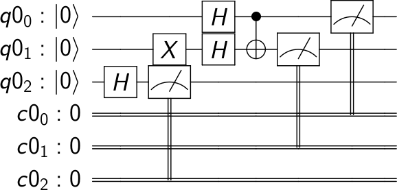
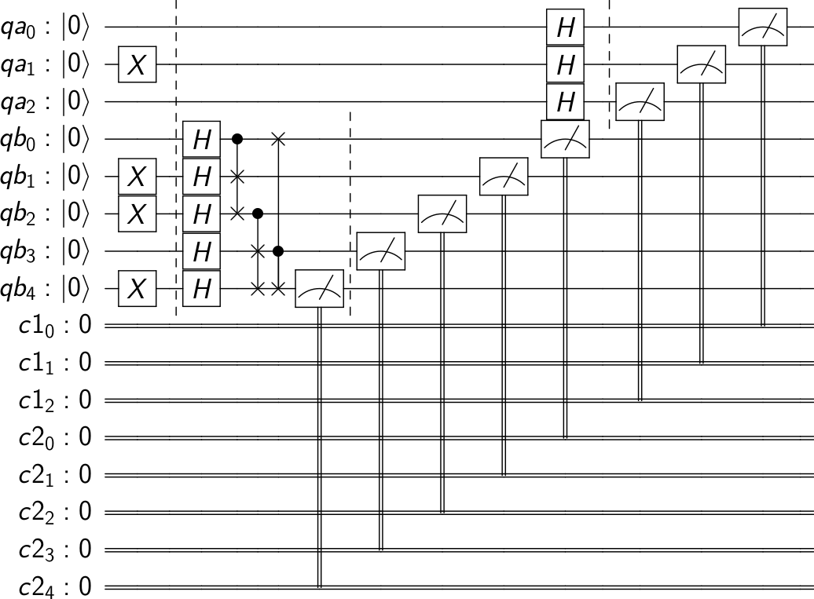
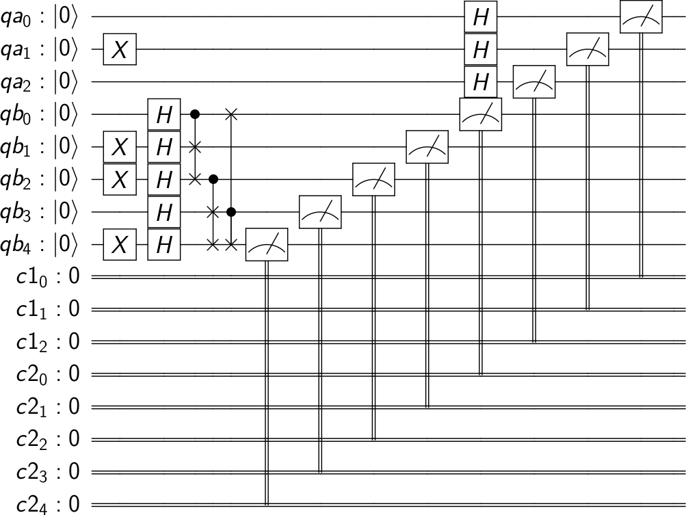
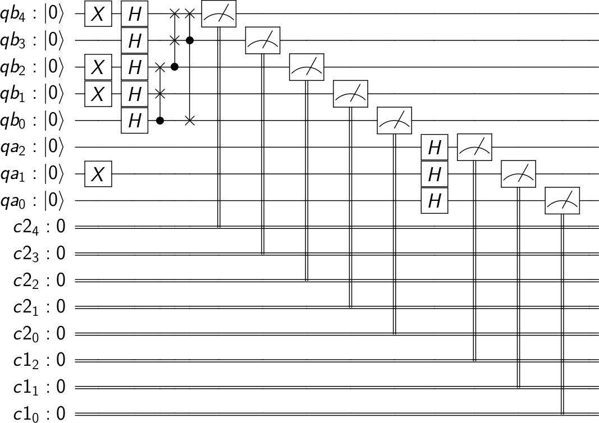
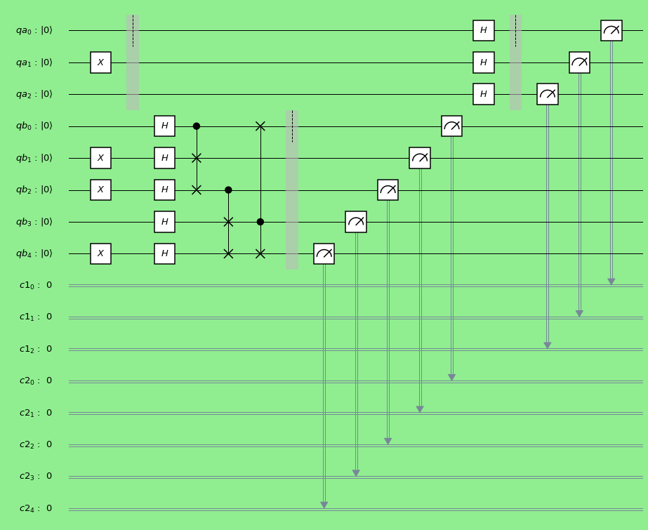
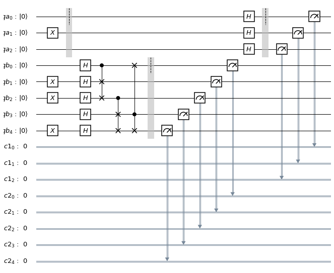

.. _Visualizing a Quantum Circuit:

Visualizing a Quantum Circuit
=============================

.. code:: python

    from qiskit import QuantumCircuit, ClassicalRegister, QuantumRegister

Drawing a Quantum Circuit
-------------------------

When building a quantum circuit it often helps to draw the circuit. This
is supported natively by a ``QuantumCircuit`` object. You can either
just call ``print()`` on the circuit or call the ``draw()`` method on
the object. This will render a `ASCII art
version <https://en.wikipedia.org/wiki/ASCII_art>`__ of the circuit
diagram.

.. code:: python

    # Build a quantum circuit

    n = 3  # number of qubits
    q = QuantumRegister(n)
    c = ClassicalRegister(n)

    circuit = QuantumCircuit(q, c)

    circuit.x(q[1])
    circuit.h(q)
    circuit.cx(q[0], q[1])
    circuit.measure(q, c);

.. code:: python

    print(circuit)

.. raw:: html

    <pre style="word-wrap: normal;white-space: pre;line-height: 15px;">

                               ┌───┐        ┌─┐
    q0_0: |0>──────────────────┤ H ├──■─────┤M├
                     ┌───┐┌───┐└───┘┌─┴─┐┌─┐└╥┘
    q0_1: |0>────────┤ X ├┤ H ├─────┤ X ├┤M├─╫─
             ┌───┐┌─┐└───┘└───┘     └───┘└╥┘ ║
    q0_2: |0>┤ H ├┤M├─────────────────────╫──╫─
             └───┘└╥┘                     ║  ║
     c0_0: 0 ══════╬══════════════════════╬══╩═
                   ║                      ║
     c0_1: 0 ══════╬══════════════════════╩════
                   ║
     c0_2: 0 ══════╩═══════════════════════════
                                               </pre>

.. code:: python

    circuit.draw()

.. raw:: html

    <pre style="word-wrap: normal;white-space: pre;line-height: 15px;">
                               ┌───┐        ┌─┐
    q0_0: |0>──────────────────┤ H ├──■─────┤M├
                     ┌───┐┌───┐└───┘┌─┴─┐┌─┐└╥┘
    q0_1: |0>────────┤ X ├┤ H ├─────┤ X ├┤M├─╫─
             ┌───┐┌─┐└───┘└───┘     └───┘└╥┘ ║
    q0_2: |0>┤ H ├┤M├─────────────────────╫──╫─
             └───┘└╥┘                     ║  ║
     c0_0: 0 ══════╬══════════════════════╬══╩═
                   ║                      ║
     c0_1: 0 ══════╬══════════════════════╩════
                   ║
     c0_2: 0 ══════╩═══════════════════════════
                                               </pre>

Alternative Renderers for Circuits
----------------------------------

While a text output is useful for quickly seeing the output while
developing a circuit it doesn’t provide the most flexibility in it’s
output. There are 2 other alternative output renderers for the quantum
circuit. One uses `matplotlib <https://matplotlib.org/>`__ and the other
uses `LaTex <https://www.latex-project.org/>`__ leveraging the `qcircuit
package <https://github.com/CQuIC/qcircuit>`__. These can be specified
by using ``mpl`` and ``latex`` values for the ``output`` kwarg on the
draw() method.

.. code:: python

    # Matplotlib Drawing
    circuit.draw(output='mpl')

.. image:: ../images/figures/visualizing_a_quantum_circuit_8_0.png
  :alt: Matplotlib drawing of a quantum circuit.

.. code:: python

    # Latex Drawing
    circuit.draw(output='latex')

Controlling output from circuit.draw()
--------------------------------------

By default, the draw method returns the rendered image as an object and
does not output anything. The specific class returned depends on the output
specified: ``'text'``\(the default output type) returns a ``TextDrawer`` object,
``'mpl'`` returns a ``matplotlib.Figure`` object, and ``latex`` returns
a ``PIL.Image`` object. Having the return types enables modifying or
directly interacting with the rendered output from the drawers. Jupyter
notebooks understand these return types and render it for us in this
tutorial, but when running outside of a Jupyter notebook, you do not have this
feature automatically. Instead, the ``draw()`` method has optional
arguments to display or save the output. When ``draw()`` is specified,
you can specify a path to save the rendered output to by using the ``filename``
kwarg. Or if you’re using the ``mpl`` or ``latex`` outputs, you can leverage
the ``interactive`` kwarg to open the image in a new window.

Customizing the output
----------------------

Depending on the output there are also options to customize the circuit
diagram rendered by the circuit.

Disable Plot Barriers and Reversing Bit Order
~~~~~~~~~~~~~~~~~~~~~~~~~~~~~~~~~~~~~~~~~~~~~

The first two options are available with all 3 backends and they let you
configure both the bit orders and whether or not you draw barriers.
You can set the bit orders and barriers with the ``reverse_bits`` kwarg
and ``plot_barriers`` kwarg respectively. The following examples will work
with any output backend, only ``latex`` is used for brevity.

.. code:: python

    # Draw a new circuit with barriers and more registers

    q_a = QuantumRegister(3, name='qa')
    q_b = QuantumRegister(5, name='qb')
    c_a = ClassicalRegister(3)
    c_b = ClassicalRegister(5)

    circuit = QuantumCircuit(q_a, q_b, c_a, c_b)

    circuit.x(q_a[1])
    circuit.x(q_b[1])
    circuit.x(q_b[2])
    circuit.x(q_b[4])
    circuit.barrier()
    circuit.h(q_a)
    circuit.barrier(q_a)
    circuit.h(q_b)
    circuit.cswap(q_b[0], q_b[1], q_b[2])
    circuit.cswap(q_b[2], q_b[3], q_b[4])
    circuit.cswap(q_b[3], q_b[4], q_b[0])
    circuit.barrier(q_b)
    circuit.measure(q_a, c_a)
    circuit.measure(q_b, c_b);

.. code:: python

    # Draw the circuit
    circuit.draw(output='latex')

.. code:: python

    # Draw the circuit with reversed bit order
    circuit.draw(output='latex', reverse_bits=True)

.. image:: ../images/figures/visualizing_a_quantum_circuit_14_0.png
  :alt: LaTeX drawing of a quantum circuit with the qubits ordered from bottom
    to top.

.. code:: python

    # Draw the circuit without barriers
    circuit.draw(output='latex', plot_barriers=False)

.. code:: python

    # Draw the circuit without barriers and reverse bit order
    circuit.draw(output='latex', plot_barriers=False, reverse_bits=True)

    arranged from bottom to top.

Backend specific customizations
~~~~~~~~~~~~~~~~~~~~~~~~~~~~~~~

You can customize the output diagram for specific backends.

Use the ``line_length`` kwarg for the ``text`` backend
to set a maximum width for the output. When a diagram is wider than
the ``line_length`` kwarg, it will wrap the diagram to the next line.

The ``scale`` option is used by both the ``mpl`` and
``latex`` backends to adjust the size of the output image. ``scale`` is a
multiplicative adjustment factor used to scale the output size.

The ``mpl`` backend has the ``style`` kwarg, which is used to
customize the output. The ``style`` kwarg takes in a dict with many
different options. ``style`` provides a high level of flexibility and
enables style formatting like changing colors, changing rendered text
for different types of gates, different line styles, etc.

.. table:: : ``style`` kwarg configuration options

    ====================== ================================ ========================================
          OPTION            DEFAULT VALUES                       DESCRIPTION
    ====================== ================================ ========================================
    displaycolor(dict)      | id:``#F0E442``
                            | u0:``#E7AB3B``
                            | u1:``#E7AB3B``
                            | u2:``#E7AB3B``
                            | u3:``#E7AB3B``
                            | x:``#58C698``
                            | y:``#58C698``
                            | z:``#58C698``
                            | h:``#70B7EB``
                            | s:``#E0722D``
                            | sdg:``#E0722D``
                            | t:``#E0722D``
                            | tdg:``#E0722D``
                            | rx:``#ffffff``
                            | ry:``#ffffff``
                            | rz:``#ffffff``
                            | reset:``#D188B4``
                            | target:``#70B7EB``
                            | meas:``#D188B4``
                                                            | The color codes to use for each circuit element. You must specify all the necessary values when using this dictionary. There is no provision for passing an incomplete dict and using values from the default otherwise.
    textcolor(str)          | ``#000000``                   | Color code for text
    subtextcolor(str)       | ``#000000``                   | Color code for subtext
    linecolor(str)          | ``#000000``                   | Color code for lines.
    creglinecolor(str)      | ``#778899``                   | Color code for classical register lines.
    gatetextcolor(str)      | ``#000000``                   | Color code for gate text.
    gatefacecolor(str)      | ``#ffffff``                   | Color code for gates.
    barrierfacecolor(str)   | ``#bdbdbd``                   | Color code for barriers.
    backgroundcolor(str)    | ``#ffffff``                   | Color code for the diagram background.
    fontsize(int)           | 13                            | Font size for text.
    subfontsize(int)        | 8                             | Font size to use for subtext.
    displaytext(dict)       | id: id
                            | u0: U_0
                            | u1: U_1
                            | u2: U_2
                            | u3: U_3
                            | x: X
                            | y: Y
                            | z: Z
                            | h: H
                            | s: S
                            | sdg: :math:`S^\dagger`
                            | t: T
                            | tdg: :math:`T^\dagger`
                            | rx: R_x
                            | ry: R_y
                            | rz: R_z
                            | reset: :math:`|0\rangle`
                                                            | A dictionary of the text to use for each element type in the output visualization. ou must specify all the necessary values when using this dictionary. There is no provision for passing an incomplete dict and using values from the default otherwise.
    latexdrawerstyle(bool) | FALSE                          | When set to ``True``, enable latex mode which will draw gates like the ``latex`` output modes.
    usepiformat(bool)      | FALSE                          | When set to ``True``, use radians for output.
    fold(int)              | 20                             | The number of circuit elements to fold the circuit.
    cregbundle(bool)       | FALSE                          | If set ``True``, bundle classical registers.
    showindex(bool)        | FALSE                          | If set ``True``, draw an index.
    compress(bool)         | FALSE                          | If set ``True``, draw a compressed circuit.
    figwidth(int)          | FALSE                          | The maximum width (in inches) for the output figure.
    dpi(int)               | 150                            | The DPI to use for the output image.
    creglinestyle(str)     | ``doublet``                    | The style of line to use for classical registers. Choices are ``'solid'``, ``'doublet'``, or any valid matplotlib ``linestyle`` kwarg value.
    ====================== ================================ ========================================

.. code:: python

    # Set line length to 80 for above circuit
    circuit.draw(output='text', line_length=80)

.. raw:: html

    <pre style="word-wrap: normal;white-space: pre;line-height: 15px;">                              ░                                               »
    qa_0: |0>─────────────────────░───────────────────────────────────────────────»
                            ┌───┐ ░                                               »
    qa_1: |0>───────────────┤ X ├─░───────────────────────────────────────────────»
                            └───┘ ░                                               »
    qa_2: |0>─────────────────────░───────────────────────────────────────────────»
                                  ░                     ┌───┐          ░          »
    qb_0: |0>─────────────────────░─────────────────────┤ H ├─■─────X──░──────────»
                       ┌───┐      ░                ┌───┐└───┘ │     │  ░          »
    qb_1: |0>──────────┤ X ├──────░────────────────┤ H ├──────X─────┼──░──────────»
                  ┌───┐└───┘      ░           ┌───┐└───┘      │     │  ░       ┌─┐»
    qb_2: |0>─────┤ X ├───────────░───────────┤ H ├───────────X──■──┼──░───────┤M├»
                  └───┘           ░      ┌───┐└───┘              │  │  ░    ┌─┐└╥┘»
    qb_3: |0>─────────────────────░──────┤ H ├───────────────────X──■──░────┤M├─╫─»
             ┌───┐                ░ ┌───┐└───┘                   │  │  ░ ┌─┐└╥┘ ║ »
    qb_4: |0>┤ X ├────────────────░─┤ H ├────────────────────────X──X──░─┤M├─╫──╫─»
             └───┘                ░ └───┘                              ░ └╥┘ ║  ║ »
     c1_0: 0 ═════════════════════════════════════════════════════════════╬══╬══╬═»
                                                                          ║  ║  ║ »
     c1_1: 0 ═════════════════════════════════════════════════════════════╬══╬══╬═»
                                                                          ║  ║  ║ »
     c1_2: 0 ═════════════════════════════════════════════════════════════╬══╬══╬═»
                                                                          ║  ║  ║ »
     c2_0: 0 ═════════════════════════════════════════════════════════════╬══╬══╬═»
                                                                          ║  ║  ║ »
     c2_1: 0 ═════════════════════════════════════════════════════════════╬══╬══╬═»
                                                                          ║  ║  ║ »
     c2_2: 0 ═════════════════════════════════════════════════════════════╬══╬══╩═»
                                                                          ║  ║    »
     c2_3: 0 ═════════════════════════════════════════════════════════════╬══╩════»
                                                                          ║       »
     c2_4: 0 ═════════════════════════════════════════════════════════════╩═══════»
                                                                                  »
    «                      ┌───┐ ░       ┌─┐
    «qa_0: ────────────────┤ H ├─░───────┤M├
    «                 ┌───┐└───┘ ░    ┌─┐└╥┘
    «qa_1: ───────────┤ H ├──────░────┤M├─╫─
    «            ┌───┐└───┘      ░ ┌─┐└╥┘ ║
    «qa_2: ──────┤ H ├───────────░─┤M├─╫──╫─
    «         ┌─┐└───┘           ░ └╥┘ ║  ║
    «qb_0: ───┤M├───────────────────╫──╫──╫─
    «      ┌─┐└╥┘                   ║  ║  ║
    «qb_1: ┤M├─╫────────────────────╫──╫──╫─
    «      └╥┘ ║                    ║  ║  ║
    «qb_2: ─╫──╫────────────────────╫──╫──╫─
    «       ║  ║                    ║  ║  ║
    «qb_3: ─╫──╫────────────────────╫──╫──╫─
    «       ║  ║                    ║  ║  ║
    «qb_4: ─╫──╫────────────────────╫──╫──╫─
    «       ║  ║                    ║  ║  ║
    «c1_0: ═╬══╬════════════════════╬══╬══╩═
    «       ║  ║                    ║  ║
    «c1_1: ═╬══╬════════════════════╬══╩════
    «       ║  ║                    ║
    «c1_2: ═╬══╬════════════════════╩═══════
    «       ║  ║
    «c2_0: ═╬══╩════════════════════════════
    «       ║
    «c2_1: ═╩═══════════════════════════════
    «
    «c2_2: ═════════════════════════════════
    «
    «c2_3: ═════════════════════════════════
    «
    «c2_4: ═════════════════════════════════
    «                                       </pre>

.. code:: python

    # Change the background color in mpl

    style = {'backgroundcolor': 'lightgreen'}

    circuit.draw(output='mpl', style=style)

.. code:: python

    # Scale the mpl output to 1/2 the normal size
    circuit.draw(output='mpl', scale=0.5)

.. code:: python

    # Scale the latex output to 1/2 the normal size
    circuit.draw(output='latex', scale=0.5)

.. image:: ../images/figures/visualizing_a_quantum_circuit_21_0.png
  :alt: LaTeX drawing of a quantum circuit at half its default size.

Latex Source
------------

One additional option available with the latex output type is to return
the raw LaTex source code instead of rendering an image for it. This
enables easy integration in a seperate LaTex document. To use this you
can just set the ``output`` kwarg to ``'latex_source'``. You can also
use the ``filename`` kwarg to write this output directly to a file (and
still return the string) instead of returning just a string.

.. code:: python

    # Print the latex source for the visualization
    print(circuit.draw(output='latex_source'))

.. code-block:: text

    % \documentclass[preview]{standalone}
    % If the image is too large to fit on this documentclass use
    \documentclass[draft]{beamer}
    % img_width = 16, img_depth = 17
    \usepackage[size=custom,height=24,width=28,scale=0.7]{beamerposter}
    % instead and customize the height and width (in cm) to fit.
    % Large images may run out of memory quickly.
    % To fix this use the LuaLaTeX compiler, which dynamically
    % allocates memory.
    \usepackage[braket, qm]{qcircuit}
    \usepackage{amsmath}
    \pdfmapfile{+sansmathaccent.map}
    % \usepackage[landscape]{geometry}
    % Comment out the above line if using the beamer documentclass.
    \begin{document}
    \begin{equation*}
        \Qcircuit @C=0.5em @R=0.0em @!R {
                \lstick{qa_{0}: \ket{0}} & \qw & \qw \barrier{7} & \qw & \qw & \qw & \qw & \qw & \qw & \qw & \qw & \gate{H} & \qw \barrier[-1.15em]{2} & \qw & \qw & \meter & \qw & \qw\\
                \lstick{qa_{1}: \ket{0}} & \gate{X} & \qw & \qw & \qw & \qw & \qw & \qw & \qw & \qw & \qw & \gate{H} & \qw & \qw & \meter & \qw & \qw & \qw\\
                \lstick{qa_{2}: \ket{0}} & \qw & \qw & \qw & \qw & \qw & \qw & \qw & \qw & \qw & \qw & \gate{H} & \qw & \meter & \qw & \qw & \qw & \qw\\
                \lstick{qb_{0}: \ket{0}} & \qw & \qw & \gate{H} & \ctrl{1} & \qw & \qswap \qwx[4] & \qw \barrier[-1.15em]{4} & \qw & \qw & \qw & \meter & \qw & \qw & \qw & \qw & \qw & \qw\\
                \lstick{qb_{1}: \ket{0}} & \gate{X} & \qw & \gate{H} & \qswap & \qw & \qw & \qw & \qw & \qw & \meter & \qw & \qw & \qw & \qw & \qw & \qw & \qw\\
                \lstick{qb_{2}: \ket{0}} & \gate{X} & \qw & \gate{H} & \qswap \qwx[-1] & \ctrl{1} & \qw & \qw & \qw & \meter & \qw & \qw & \qw & \qw & \qw & \qw & \qw & \qw\\
                \lstick{qb_{3}: \ket{0}} & \qw & \qw & \gate{H} & \qw & \qswap & \ctrl{1} & \qw & \meter & \qw & \qw & \qw & \qw & \qw & \qw & \qw & \qw & \qw\\
                \lstick{qb_{4}: \ket{0}} & \gate{X} & \qw & \gate{H} & \qw & \qswap \qwx[-1] & \qswap & \meter & \qw & \qw & \qw & \qw & \qw & \qw & \qw & \qw & \qw & \qw\\
                \lstick{c1_{0}: 0} & \cw & \cw & \cw & \cw & \cw & \cw & \cw & \cw & \cw & \cw & \cw & \cw & \cw & \cw & \cw \cwx[-8] & \cw & \cw\\
                \lstick{c1_{1}: 0} & \cw & \cw & \cw & \cw & \cw & \cw & \cw & \cw & \cw & \cw & \cw & \cw & \cw & \cw \cwx[-8] & \cw & \cw & \cw\\
                \lstick{c1_{2}: 0} & \cw & \cw & \cw & \cw & \cw & \cw & \cw & \cw & \cw & \cw & \cw & \cw & \cw \cwx[-8] & \cw & \cw & \cw & \cw\\
                \lstick{c2_{0}: 0} & \cw & \cw & \cw & \cw & \cw & \cw & \cw & \cw & \cw & \cw & \cw \cwx[-8] & \cw & \cw & \cw & \cw & \cw & \cw\\
                \lstick{c2_{1}: 0} & \cw & \cw & \cw & \cw & \cw & \cw & \cw & \cw & \cw & \cw \cwx[-8] & \cw & \cw & \cw & \cw & \cw & \cw & \cw\\
                \lstick{c2_{2}: 0} & \cw & \cw & \cw & \cw & \cw & \cw & \cw & \cw & \cw \cwx[-8] & \cw & \cw & \cw & \cw & \cw & \cw & \cw & \cw\\
                \lstick{c2_{3}: 0} & \cw & \cw & \cw & \cw & \cw & \cw & \cw & \cw \cwx[-8] & \cw & \cw & \cw & \cw & \cw & \cw & \cw & \cw & \cw\\
                \lstick{c2_{4}: 0} & \cw & \cw & \cw & \cw & \cw & \cw & \cw \cwx[-8] & \cw & \cw & \cw & \cw & \cw & \cw & \cw & \cw & \cw & \cw\\
        }
    \end{equation*}

    \end{document}

.. code:: python

    # Save the latex source to a file
    circuit.draw(output='latex_source', filename='/tmp/circuit.tex');

circuit_drawer() as function
----------------------------

If you have an application where you prefer to draw a circuit with a
self contained function instead of as a method of a circuit object you
can directly use the ``circuit_drawer()`` function, which is part of the
public stable interface from ``qiskit.tools.visualization``. The
function behaves identically to the ``circuit.draw()`` method except
that it takes in a circuit object as required argument.

.. raw:: html

   

Note: In Qiskit Terra <= 0.7 the default behavior for the
circuit_drawer() function is to use the latex output backend, and in
0.6.x that includes a fallback to mpl if latex fails for any reason. But
starting in releases > 0.7 the default changes to use the text output.

.. raw:: html

   

.. code:: python

    from qiskit.tools.visualization import circuit_drawer

.. code:: python

    circuit_drawer(circuit, output='mpl', plot_barriers=False)

.. image:: ../images/figures/visualizing_a_quantum_circuit_27_0.png
  :alt: Matplotlib drawing of a quantum circuit without barriers.
