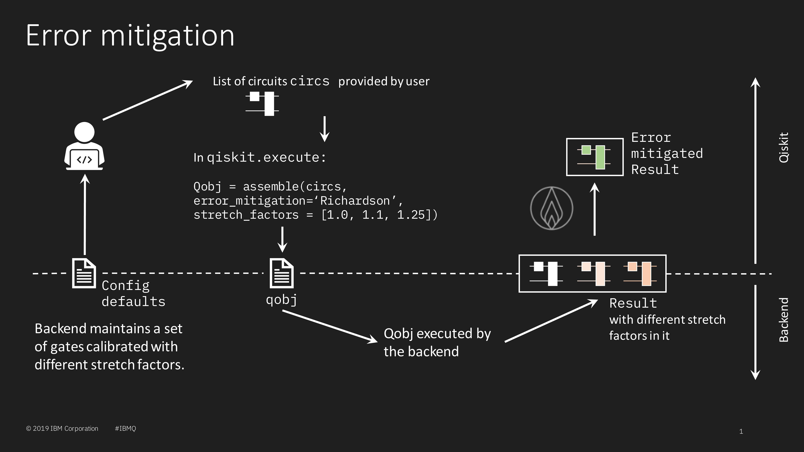

# RFC Title

| **Status**        | **Proposed/Accepted/Deprecated** |
|:------------------|:---------------------------------------------|
| **RFC #**         | ####                                         |
| **Authors**       | Daniel Egger (deg@zurich.ibm.com)            |
| **Deprecates**    | RFC that this RFC deprecates                 |
| **Submitted**     | YYYY-MM-DD                                   |
| **Updated**       | YYYY-MM-DD                                   |

RFC markdown filename should be of the form `####-rfc-title.md`. Where #### will be set as `max(rfc_####) + 1` after the acceptance of the RFC, but before its merger. If the RFC requires supporting files, a folder may be created with the same name as the RFC, `####-rfc-title`, in which the RFC should reside.

## Summary
Error mitigation can greatly improve results on noisy quantum hardware.
This is done by running a given quantum circuit several times.
In run i of the circuit the duration of all the gates is stretched by a factor c_i to increase the noise in the gates.
An improved result is then obtained by extrapolating to the zero-order noise limit c->0.
The purpose of this RFC is to discuss how to implement error mitigation in Qiskit such that it is usable in applications.

## Motivation
Error mitigation allows users to significantly improve their results.
It is expected that partners and members of the IBM Q network will benefit from this by being able to easily improve the quality of their results.

## User Benefit
The target users of this work are those who run quantum circuits for applications of quantum computing.

## Design Proposal
There are several ways to implement error mitigation.

### Simple error mitigation
The simplest way to implement error mitigation is to run the quantum circuit several times. 
In each run the entangling two-qubit gate is replaced several entangling two-qubit gates such that the additional gates have no effect.
For instance, replacing each CNOT gate in a quantum circuit by an odd number of CNOT gates results in the same quantum circuit in the ideal case.
This has, for example, been implemented in https://arxiv.org/abs/1905.02666.
This approach is also valid for other types of two-qubit gates such as the CZ gate.

See https://github.com/Qiskit/qiskit-aqua/pull/683 which aims to implement this error mitigation method.

**The advantage of this method is:**
- Simplicity, it is easy to implement and understand.

**The limitations of this method are**:
- Quantum circuits that are already very deep may not see any gain since replacing each CNOT gate with three CNOT gates may produce circuits which, when executed, result in noise only.
- It does not include single-qubit gates.
- The effective stretch factors to chose from are very limited.
- Some two-qubit gates, such as root-SWAP, need to be applied more than twice to compose to the identity.

### Backend constrained error mitigation
When implementing error mitigation using stretch factors, as is done in https://arxiv.org/abs/1805.04492, new pulses must be defined and calibrated for the different stretch factors c_i.
To implement error mitigation in the manner the backend could have a set of pre-defined calibrated pulses with different stretch factors.
For instance, following Kandala et al., the backend could store calibrated pulses for c=1 (i.e. the pulses used in regular operations), c=1.1, c=1.25, and c=1.5.
At execute time, the user would specify that he wants to run a quantum circuit using error mitigation.
The pulse scheduler would then create four copies of the quantum circuit, each with a different stretch factor supported by the backend.
Alternatively, the user could elect to use only a subset of the calibrate stretch factors.

**The advantages of this method are:**
- The user does not need to know much about error mitigation, a simple flag at execute time would most likely suffice.
- This allows error mitigation to be applied on single-qubit and two-qubit gates.
- Circuits that have many gates may still benefit from error mitigation as stetch factors such as c=1.1, c=1.25, and c=1.5 do not emphasis the noise as much as replacing each two-qubit gate by three two-qubit gates.
- It is fast in that the user does not need to run many quantum circuits.

**The limitations of this method are**:
- The user cannot specify his own stretch factors.
- It increases the amount of gates that the backend needs to calibrate.

### User specified error mitigation
In a more complex implementation the user specifies which stretch factors to use.
This will, therefore, require the user to run calibration procedures to calibrate the gates for each individual stretch factor before the intended quantum circuit can be run with error mitigation.
This solution may be overly complex as the user has to calibrate himself the stretched gates.
The calibration of stretched gates, could be automated to simplify the task for the user, but this would not decrease the run time.
Qiskit-ignis would most likely need to be involved ontop of qiskit-aqua and qiskit-terra.

**The advantages of this method are:**
- It is very flexible.
- This allows error mitigation to be applied on single-qubit and two-qubit gates.
- The stretch factors may be chosen as a function of the depth of the quantum circuit.

**The limitations of this method are**:
- It requires a lot of knowledge from the user.
- It requires that the user run many calibration jobs in addition to his quantum circuit.

## Detailed Design
Here we focus on the implementation details of the Backend constrained error mitigation.
An overview of this method is shown in the figure below.



The backend will have a set of calibrated gates with different stretch factors that will be made available to Qiskit through the config file.
A backend may implement as many stretch factors as is deemed reasonable by those who maintain the backend.
A backend may also have the choice to not implement error mitigation at all.
Ideally, each gate on the backend will be available with the same set of stretch factors.
However, this may not always be the case.
For example, a 20 qubit device may only have stretched gates calibrated for qubits zero to four.
Therefore, the stretch factors will be specified in the `gateconfig` schema (see `qiskit/schemas/backend_configuration_schema.json`) which will be updated as follows
```
"gateconfig": {
    "type": "object",
    "required": ["name", "parameters", "qasm_def"],
    "properties": {
        ...
        "stretch_factor": {
            "type": "string"
            "description": "The stretch factor of the gate for error mitigation (if supported)."
        }
    }
}
```
To facilitate the user experience, helper functions that show the available stretch factors, will be created.
First, we define that a given qubit has stretch factor `c` available if all gates that involve this qubit are available with this stretch factor.
The user will thus be able to query the backend to find out which stretch factors are available on a given list of qubits:
```
def available_stretch_factors(self, qubits: List) -> List:
    """Returns a list of stretch factors available for the given qubits."""
```
For example to find the stretch factors available to qubits 0, 1, and 3, the user would do `backend.available_stretch_factors([0, 1, 3])`.
Similarly, the user may query the backend to find out which qubits support a given list of stretch factors.
```
def available_qubits(self, stretch_factors: List) -> List:
    """Returns a list of qubits for which the given stretch factors are available."""
```
The user may also query the backend to find out how the error mitigation is configured.
```
def richardson_error_mitigation_config(self) -> List:
    """Returns a List of dict showing the available configuration of the richardson error mitigation."""
```
The returned list would contain dictionaries of the form
```
{'stretch_factors': list, 'qubits': list}.
```
For example, the list
```
[
  {'stretch_factors': ['1.0', '1.1', '1.25'], 'qubits': [0, 1, 2, 3]},
  {'stretch_factors': ['1.0', '1.1'], 'qubits': [0, 1, 2, 3, 4]}
]
```
would imply that qubit 4 does not have stretch factor 1.25 available.

To execute a quantum circuit with error mitigation, the user would do
```
execute(circ, backend, ..., error_mitigation='richardson')
```
to use all the stretch factors available to the qubits in the quantum register of `circ`.
Additionally, the user may specify a subset of stretch factors to use by doing
```
execute(circ, backend, ..., error_mitigation='richardson', stretch_factors=[1.0, 1.25, 1.5]).
```
This will require a validation step, done in Qiskit Terra and based on the `config`, to check that the specified stretch factors are available for all of the qubits in the quantum register of `circ`.
If this is not the case, an error will be raised.
Here, `error_mitigation` specifies the error mitigation method to use.
This value would by default be `None` when error mitigation is not used.
The changes needed in Qiskit to implement error mitigation would require changes in the `assemble` function.
`assemble` would detect that the user requires error mitigation and replace each circuit by several circuits, one for each stretch factor.
The `experiments` in the resulting `qobj` would have an entry in the header that specifies the stretch factor.
For example, the `qobj` for two circuits (`circA` and `circB`) to be run with error mitigation with three stretch factors would look like
```
print(qobj.experiments[0])
{
    'config': {...},
    'header': {'name': 'circA_ef01a', 'stretch_factor': '1.0', ...},
    'instructions': {...}
}

print(qobj.experiments[1])
{
    'config': {...},
    'header': {'name': 'circA_ef01b', 'stretch_factor': '1.1', ...},
    'instructions': {...}
}
print(qobj.experiments[3])
{
    'config': {...},
    'header': {'name': 'circB_ec01a', 'stretch_factor': '1.0', ...},
    'instructions': {...}
}

print(qobj.experiments[4])
{
    'config': {...},
    'header': {'name': 'circB_ec01b', 'stretch_factor': '1.1', ...},
    'instructions': {...}
}
```
Here, the instructions for experiments 0, 1, and 2 are identical since they correspond to `circA`.
The instructions for experiments 3, 4, and 5, are also identical since they correspond to `circB`.
Therefore, the function `assemble_circuits`, called by assemble, will be modified. 
Currently, `assemble_circuits` contains a loop over the provided circuits:
```
for circuit in circuits:
    ...
    
    experiments.append(QasmQobjExperiment(instructions=instructions, header=header,
                                          config=config))
```
We could modify this loop to be sensitive to error mitigation
```
for circuit in circuits:
    ...
    
    if error_mitigation == 'richardson':
        config = QasmQobjExperimentConfig(...)
        
        instructions = []
        # code to create the instructions is unchanged
    
        for c in stretch_factors:
            header = QobjExperimentHeader(..., stretch_factor=c)
        
            experiments.append(QasmQobjExperiment(instructions=instructions, header=header,
                                                  config=config))
    else:
        header = QobjExperimentHeader(..., stretch_factor=None)
        experiments.append(QasmQobjExperiment(instructions=instructions, header=header,
                                              config=config))
```
This implies that the header of the `QasmQobjExperiment` will need to be modified to include an attribute, namely the `stretch_factor`.

### Backend execution
The backend will have to be able to detect that stretch factors are present in the header of the `qobj.experiments`.
This will then signal to the backend what type of gates to use to execute each circuit.

### Result returned by the backend
The result returned by the backend would contain the results for the circuits executed with different stretch factors.
This result object could then be given to a Richardson error mitigation module in Qiskit Ignis that would perform the extrapolation to the zero-noise limit.
Ideally, this module will give the user some freedom in how this extrapolation is done.

Here are some additional considerations:
- This implementation of error mitigation is only a meaningful option for quantum circuits and not for schedules.

## Alternative Approaches
See section Simple error mitigation and section User specified error mitigation.

## Questions
- The Backend constrained error mitigation requires extra effort from the backend to calibrate gates with different stretch factors. We need to check that the resulting overhead is acceptable.

## Future Extensions
See section User specified error mitigation.
